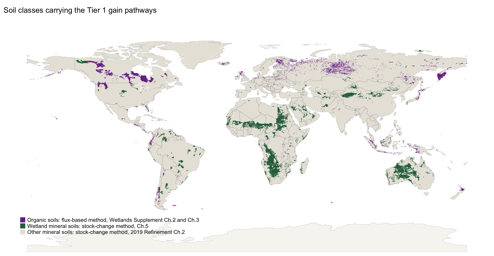
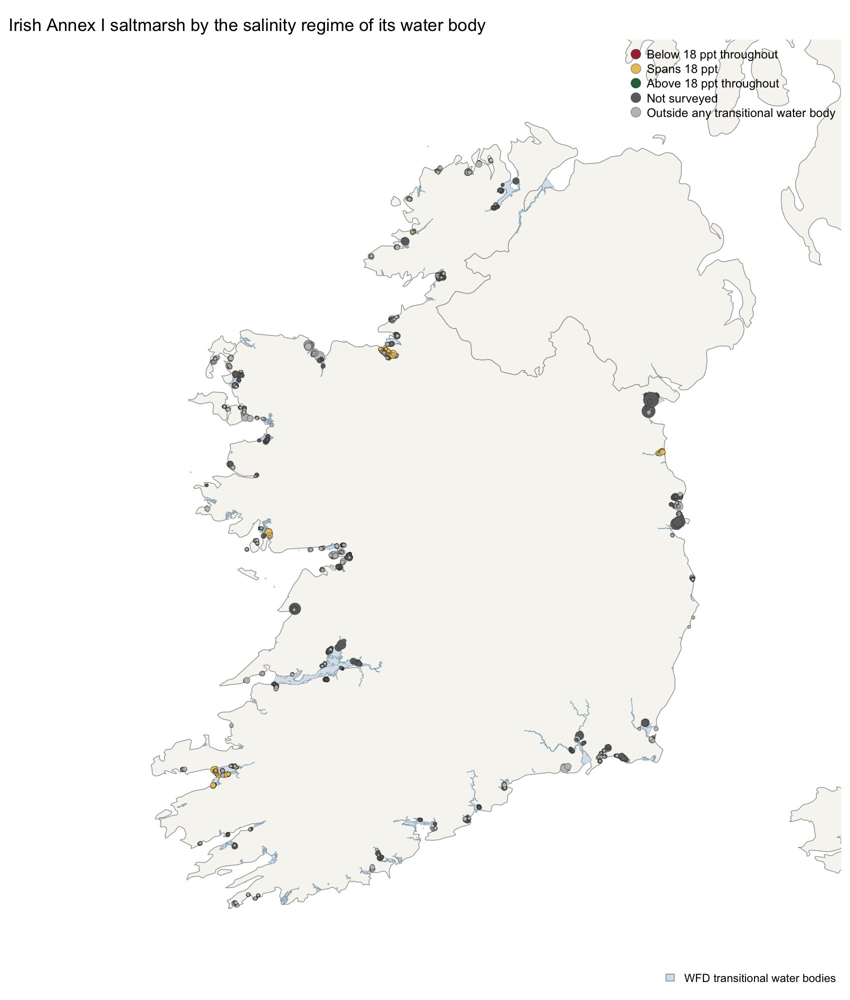

```{r}
#| label: setup
#| echo: false

# Base R only. No external packages beyond knitr, so the document renders anywhere.
options(stringsAsFactors = FALSE, scipen = 999)

# Figures are written as PNGs to 03.outputs/figures/ as a side effect of rendering, so the
# same files the document displays are the ones available for slides and the README. Base
# graphics only, consistent with the no-dependencies rule.
knitr::opts_chunk$set(echo = TRUE, fig.path = "../03.outputs/figures/",
                      dev = "png", dpi = 600, fig.width = 9, fig.height = 5.5)

PAL <- c(pos = "#2C6E49", neg = "#A4303F", mid = "#7A7A7A", hi = "#1D3557", lo = "#E9C46A")

# Unit conversions used throughout.
# Area-weighted mean, used by the reference-stock and Irish soils sections.
wmean <- function(x, w) sum(x * w) / sum(w)

C_TO_CO2 <- 44 / 12      # tonnes CO2 per tonne C
CH4C_TO_CH4 <- 16 / 12   # tonnes CH4 per tonne CH4-C
N_TO_N2O <- 44 / 28      # tonnes N2O per tonne N2O-N
```

------------------------------------------------------------------------

**Running title:** Net balance of IPCC soil carbon gain pathways

# Highlights

-   No IPCC chapter weighs a countable soil carbon gain against its own methane and nitrous oxide.
-   First net balance across every Tier 1 and Tier 2 soil carbon gain pathway on one axis.
-   Five of thirteen rewetting cases turn negative at GWP-20, all of them temperate or boreal.
-   For a minority of pathways the emission metric, not the emission factor, sets the sign.

# Introduction

The 2013 Supplement to the 2006 IPCC Guidelines, published in 2014, marks the point at which soil carbon *gains* became countable [@ipcc2014wetlands]. Its Chapter 3 states that Equation 3.1 replaces Equations 2.24 and 2.26 of the 2006 Guidelines, because those "implicitly assumed that organic soils can only lose carbon, while in fact undrained or rewetted organic soils can accumulate soil organic carbon if covered with vegetation". The result was the first negative Tier 1 emission factors in the history of the guidelines, and with them the first inventory-grade basis for claiming a soil carbon removal on a rewetted peatland, a replanted mangrove or an improved pasture.

A countable gain, however, is not the same object as a climate benefit, and the guidance does not connect the two. Three properties of the corpus stand in the way. The gain pathways are distributed across two supplements and five chapters and have never been assembled on a single axis. Their duration rules differ by more than an order of magnitude: coastal wetland accumulation runs to a stock ceiling roughly two centuries distant, inland mineral wetland rewetting runs forty years as two consecutive twenty-year blocks, mineral soil management runs twenty years, and organic soil rewetting applies from the year of rewetting with no transition period and no terminal date at all. And the Wetlands Supplement performs no greenhouse gas weighting anywhere in its 354 pages, so no document in the corpus sets a pathway's carbon dioxide gain against the methane and nitrous oxide it provokes.

The consequence is practical. A jurisdiction compiling an inventory, or a developer designing a project, cannot determine from the guidance alone whether a given intervention on a given site reduces radiative forcing. The arithmetic that would answer the question is absent by construction, because emission metrics are a policy choice the IPCC methodology reports declined to make and AR6 Box 7.3 declines to recommend [@forster2021].

One prior study performs the necessary subtraction. Wilson et al. [@wilson2016], written by the Supplement's own authors, weight the drained and rewetted factors at GWP-100 and difference them, reporting large benefits for most land uses and a single negative case in temperate nutrient-rich Forest Land. Their scope is the Supplement's Chapters 2 and 3, that is, inland organic soils, and their weighting is GWP-100 alone. Zhang et al. [@zhang2025] have since taken the second step, testing metric sensitivity by Monte Carlo on United Kingdom peatlands and finding that the choice of horizon turns one restoration step from a near-certainty into a 42.2% chance of increasing emissions under GWP-20, without reversing the headline conclusion. Their GWP\* implementation is the one adopted in Methods below.

This paper extends both. Wilson et al. performed the subtraction for inland organic soils at a single metric; Zhang et al. tested metric sensitivity for one country and one pathway. We encode the Tier 1 and Tier 2 default tables directly, compute the drained-minus-rewetted benefit across every combination the Supplement supports, propagate the published confidence bounds through Monte Carlo, repeat the calculation at a twenty-year horizon, and add the duration dimension that neither study considered. We then place the remaining pathways on the same axis and test each countable gain against its own non-carbon-dioxide offset. The increment is coverage and the joint treatment of metric, duration and offset, not the observation that a horizon matters. The central finding is that for a substantial minority of pathways the sign of the benefit is determined by the metric rather than by the emission factor, and that the metric test and the uncertainty test select the same rows, which makes metric choice a load-bearing accounting decision rather than a presentational one.

## 1.1 Terminology

Two distinctions must be held throughout. Flux-based accounting, area multiplied by an annual emission factor, applies to organic soils only. Mineral soil is stock-change: Equation 2.25 differences two modelled equilibrium stocks and divides by a transition period. There is no flux-based Tier 1 or Tier 2 method for improved grassland. Separately, there is no reference stock (`SOCref`) for peat, because Batjes excluded organic soils by design [@batjes2011]. That exclusion is the structural reason the two accounting logics coexist and must be reported separately rather than summed.

# Methods

The IPCC reports removals as negative and emissions as positive. For legibility, gains in this manuscript are reported as positive tonnes of carbon dioxide equivalent per hectare per year removed, and the sign is stated in every table caption. Sign conventions are treated as contractual: no quantity changes sign between a chunk and its caption.

## 2.1 Counterfactuals

::: callout-important
A rewetted organic soil emits methane and is a net source in absolute terms in every climate zone and nutrient class. That is expected, it is a property of wet peat, and it is not a finding. The hypothesis concerns the *intervention*, so the quantity of interest is the difference between the rewetted state and the drained state it replaces:

$$\text{benefit} = \text{net flux}_{\text{drained}} - \text{net flux}_{\text{rewetted}}$$

Reporting the absolute rewetted flux as though it were a result would invert the published conclusion of Wilson et al. [@wilson2016] and contradict Günther et al. [@gunther2020]. The absolute fluxes appear below as model inputs, in Methods, and nowhere in Results.
:::

## 2.2 Emission factors

Because the Supplement performs no weighting and AR6 recommends no single metric, results are reported under GWP-100 for comparability with inventory practice and under GWP-20 to expose the near-term methane penalty. Allen et al. [@allen2022], signed by both sides of the GWP\* dispute, recommend reporting short-lived and long-lived gases separately rather than adjudicating between metrics, and we follow that position: the metric panel is a sensitivity, not a claim about which metric is correct. The AR6 values used throughout are given in @tbl-metrics.

```{r}
#| label: tbl-metrics
#| echo: true

# AR6 WGI Table 7.15, values including carbon-cycle and chemical responses.
GWP <- data.frame(
  gas    = c("CH4_fossil", "CH4_nonfossil", "N2O"),
  gwp20  = c(82.5, 79.7, 273),
  gwp100 = c(29.8, 27.0, 273),
  gtp100 = c(7.5, 4.7, 233)
)

g100_ch4 <- GWP$gwp100[GWP$gas == "CH4_nonfossil"]
g20_ch4  <- GWP$gwp20[GWP$gas == "CH4_nonfossil"]
g100_n2o <- GWP$gwp100[GWP$gas == "N2O"]

# GWP* after Smith, Cain & Allen (2021), as implemented by Zhang et al. (2025):
#   E_CO2we = (4.53 * E(t) - 4.25 * E(t-20)) * GWP100
# Defined here and reported as a sensitivity; a step change to a sustained flux, aged
# past the 20-year window, is charged 0.28 x GWP100 rather than 1.00 x GWP100.
gwp_star <- function(e_now, e_lag20, gwp100 = g100_ch4) {
  (4.53 * e_now - 4.25 * e_lag20) * gwp100
}

knitr::kable(GWP, caption = "AR6 Table 7.15 emission metrics used throughout. Biogenic methane is weighted at 27.0 at GWP-100, not at a value adjusted for the molar mass of carbon.")

cat(sprintf("Sustained CH4 flux under GWP*: %.2f x GWP100, versus 1.00 x GWP100 under GWP-100.\n",
            gwp_star(1, 1) / g100_ch4))
```

## 2.3 Reference mineral soils

Table 2.3 of the 2019 Refinement supplies the reference condition stock `SOCref`, 0 to 30 cm, under native vegetation [@ipcc2019refinement]. The values are the arithmetic means from Batjes [@batjes2010; @batjes2011]. The forty-two cells encoded below span the Cool temperate, Warm temperate and Tropical zones; the Polar and Boreal rows are not encoded, and the consequence is set out in Limitations.

```{r}
#| label: socref
#| echo: true

# IPCC 2019 Refinement Vol.4 Ch.2 Table 2.3 (UPDATED).
# value = t C/ha 0-30 cm; err = 95% CI as % of mean; n = profiles.
socref <- read.csv(text = "
zone,soil,value,err,n
C2,HAC,43,8,177
C2,LAC,33,90,NA
C2,SAN,13,33,10
C2,VOL,20,90,NA
C2,WET,87,90,NA
C1,HAC,81,5,334
C1,LAC,76,51,6
C1,SAN,51,13,126
C1,POD,128,14,45
C1,VOL,136,14,28
C1,WET,128,13,42
W2,HAC,24,5,781
W2,LAC,19,16,41
W2,SAN,10,5,338
W2,VOL,84,65,10
W2,WET,74,17,49
W1,HAC,64,5,489
W1,LAC,55,8,183
W1,SAN,36,23,39
W1,POD,143,30,9
W1,VOL,138,12,42
W1,WET,135,28,28
T4,HAC,21,5,554
T4,LAC,19,10,135
T4,SAN,9,9,164
T4,VOL,50,90,NA
T4,WET,22,17,32
T3,HAC,40,7,226
T3,LAC,38,5,326
T3,SAN,27,12,76
T3,VOL,70,90,NA
T3,WET,68,17,55
T2,HAC,60,8,137
T2,LAC,52,6,271
T2,SAN,46,20,43
T2,VOL,77,27,14
T2,WET,49,19,33
T1,HAC,51,10,114
T1,LAC,44,11,84
T1,SAN,52,34,11
T1,VOL,96,31,10
T1,WET,82,50,12
")

zone_names <- c(
  C2 = "Cool temp dry", C1 = "Cool temp moist",
  W2 = "Warm temp dry", W1 = "Warm temp moist",
  T4 = "Tropical dry", T3 = "Tropical moist",
  T2 = "Tropical wet", T1 = "Tropical montane"
)

cat(sprintf("Table 2.3 cells encoded: %d of the published table, spanning %d climate zones and %d soil classes. Polar and Boreal rows are not encoded.\n",
            nrow(socref), length(unique(socref$zone)), length(unique(socref$soil))))
cat(sprintf("Stated error ranges from +/-%d%% to +/-%d%%.\n",
            min(socref$err), max(socref$err)))
```

## 2.4 Emission factors for rewetted soils

Chapter 3 of the Wetlands Supplement applies from the year of rewetting with no transition period. Its factors are composite, covering soil and non-tree vegetation together, and are set out with their published bounds in @tbl-rewetted.

```{r}
#| label: tbl-rewetted
#| echo: true

# Wetlands Supplement Table 3.1 (CO2), 3.2 (DOC), 3.3 (CH4), and Table 2.2 (drained DOC).
# CO2 in t C/ha/yr, negative = removal. CH4 in kg CH4-C/ha/yr.
rewet <- read.csv(text = "
zone,nutrient,co2_c,co2_lo,co2_hi,ch4_c,ch4_lo,ch4_hi,n
Boreal,Poor,-0.34,-0.59,-0.09,41,0.5,246,26
Boreal,Rich,-0.55,-0.77,-0.34,137,0,493,39
Temperate,Poor,-0.23,-0.64,0.18,92,3,445,43
Temperate,Rich,0.50,-0.71,1.71,216,0,856,15
Tropical,All,0.00,NA,NA,41,7,134,11
")

doc <- data.frame(
  zone      = c("Boreal","Temperate","Tropical"),
  drained   = c(0.12, 0.31, 0.82),   # Table 2.2, t C/ha/yr
  rewetted  = c(0.08, 0.24, 0.51)    # Table 3.2, t C/ha/yr
)

rewet$doc_rewet <- doc$rewetted[match(rewet$zone, doc$zone)]

# Absolute flux of the rewetted state, positive = source, t CO2e/ha/yr.
# Reported here as a model input only; see the counterfactual requirement above.
rewet$co2_tCO2   <- (rewet$co2_c + rewet$doc_rewet) * C_TO_CO2
rewet$ch4_tCO2e  <- (rewet$ch4_c / 1000) * CH4C_TO_CH4 * g100_ch4
rewet$net_g100   <- round(rewet$co2_tCO2 + rewet$ch4_tCO2e, 2)
rewet$co2_only   <- round(rewet$co2_c * C_TO_CO2, 2)

knitr::kable(
  rewet[, c("zone","nutrient","n","co2_only","net_g100")],
  row.names = FALSE,
  col.names = c("Zone","Nutrient status","n","CO2 only","Absolute net GWP-100"),
  caption = "Model input: rewetted organic soils, t CO2e/ha/yr, positive = source. `CO2 only` is the countable soil carbon term; the net column adds DOC and methane. These are absolute fluxes, not benefits."
)

sink_co2 <- rewet$zone[rewet$co2_only < 0]
src_net  <- rewet$zone[rewet$net_g100 > 0]
cat(sprintf("Zones booking a CO2 removal: %s.\n", paste(unique(sink_co2), collapse = ", ")))
cat(sprintf("Of those, still a net GWP-100 source in absolute terms: %s.\n",
            paste(intersect(sink_co2, src_net), collapse = ", ")))
```

## 2.5 Emission factors for drained soils

```{r}
#| label: drained
#| echo: true

# Wetlands Supplement Chapter 2. Rows encoded only where every term was read directly
# from the source table; NA marks a value not yet verified, and the code reports those
# rather than silently dropping them.
#   co2      Table 2.1, t CO2-C/ha/yr
#   ch4_land Table 2.3, kg CH4/ha/yr
#   n2o_n    Table 2.5, kg N2O-N/ha/yr
#   fdit     Table 2.4, indicative Frac_ditch
#   ch4_dit  Table 2.4, kg CH4/ha/yr from ditches
# Extracted directly from the source PDF and verified by two independent extraction
# methods. ch4_land and ch4_dit are methane, NOT methane-carbon.
drained <- read.csv(text = "
landuse,zone,nutrient,drainage,co2,co2_lo,co2_hi,ch4_land,n2o_n,fdit,ch4_dit,n
Forest Land,Boreal,Poor,drained,0.25,-0.23,0.73,7.0,0.22,0.025,217,59
Forest Land,Boreal,Rich,drained,0.93,0.54,1.30,2.0,3.2,0.025,217,62
Forest Land,Temperate,Unsplit,drained,2.60,2.00,3.30,2.5,2.8,0.025,217,8
Forest Land,Tropical,Unsplit,drained,5.30,-0.70,9.50,4.9,2.4,0.020,2259,21
Cropland,Temperate,Rich,drained,7.90,6.50,9.40,0.0,13.0,0.050,1165,39
Cropland,Tropical,Unsplit,drained,14.00,6.60,26.00,7.0,5.0,0.020,2259,10
Grassland,Boreal,Unsplit,drained,5.70,2.90,8.60,1.4,9.5,0.050,1165,8
Grassland,Temperate,Poor,drained,5.30,3.70,6.90,1.8,4.3,0.050,1165,7
Grassland,Temperate,Rich,deep-drained,6.10,5.00,7.30,16.0,8.2,0.050,1165,39
Grassland,Temperate,Rich,shallow-drained,3.60,1.80,5.40,39.0,1.6,0.050,527,13
Grassland,Tropical,Unsplit,drained,9.60,4.50,17.00,7.0,5.0,0.020,2259,NA
Peat extraction,Temperate,Unsplit,drained,2.80,1.10,4.20,6.1,0.30,0.050,542,20
Plantation oil palm,Tropical,Unsplit,drained,11.00,5.60,17.00,0.0,1.2,0.020,2259,10
Plantation acacia,Tropical,Unsplit,drained,20.00,16.00,24.00,2.7,NA,0.020,2259,13
")

doc_drained <- c(Boreal = 0.12, Temperate = 0.31, Tropical = 0.82)  # Table 2.2

nterm <- c("co2","ch4_land","n2o_n","ch4_dit")
cat(sprintf("Drained rows encoded: %d. Complete on all four gas terms: %d.\n",
            nrow(drained), sum(complete.cases(drained[, nterm]))))
inc <- drained[!complete.cases(drained[, nterm]), c("landuse","zone","nutrient")]
if (nrow(inc)) { cat("Rows still incomplete:\n"); print(inc, row.names = FALSE) }
```

The Supplement provides no nutrient-status split for temperate Forest Land in any of these four tables, although Equation 2.7 carries separate `EF2_F,Temp,NR` and `EF2_F,Temp,NP` terms and the accompanying text states that nutrient-poor and nutrient-rich organic soils drained for forestry have different nitrous oxide emissions. The equation and the table contradict each other. We assign the single temperate value to both nutrient classes and record it as an assumption rather than an IPCC default. This matters directly, because that row is the empirical anchor for the only published case in which rewetting does not deliver a benefit, and the rewetted temperate nutrient-rich factor it is differenced against has confidence intervals spanning zero on both carbon dioxide and methane.

## 2.6 Uncertainty propagation

Each drained and rewetted factor is published as a central value with 95% bounds. Point estimates alone cannot support a claim about the *sign* of a net flux when those bounds routinely straddle zero, so the benefit is resampled by Monte Carlo. Draws are triangular on the published central value and its bounds, a defensible shape when only three numbers are available and the underlying distribution is not stated, and the consequences of that choice are examined in Results.

Three terms are sampled: the carbon dioxide factor on the drained side, and the carbon dioxide and methane factors on the rewetted side. Four are not. Drained land methane, drained ditch methane, the ditch fraction `Frac_ditch` and the direct nitrous oxide factor carry no interval in Tables 2.3, 2.4 and 2.5 and enter at their defaults. The omission is not symmetric: it holds the drained side of the subtraction fixed in every term but one while the rewetted side varies in two, so the reported intervals both understate total uncertainty and understate it unevenly.

## 2.7 Data sources

Every emission factor and reference stock in this paper is encoded directly in the chunks above, transcribed from the published tables and carrying no external dependency. Four datasets are read from disk, each processed by a saved script that writes the derived table the manuscript reads, so no figure or statistic rests on code that was not retained.

Two are global. The IPCC soil classification is a 5 arc-minute raster derived from the Harmonised World Soil Database, and it is crossed with the FAO Global Ecological Zones of 2010 to give area weights by climate zone and soil class, with cell area computed on the sphere so that it varies correctly with latitude. Because the ecological zones are built from vegetation while the IPCC climate zones are defined by temperature, precipitation and elevation, the crosswalk between them is an approximation, and the two mountain-system zones are ambiguous; both are documented in the script and a sensitivity reassigning the mountain zones to the dry side is reported alongside the main result. Pathway areas come from the Harmonised World Soil Database itself, 300,076 polygons, with Histosols mapped to the flux-based organic soil method and Gleysols to the Chapter 5 wetland mineral method. Only dominant soil components survived the source merge, so the mapped areas are a floor rather than an estimate.

Two are Irish. The inventory analysis reads Ireland's 2026 submission to the UNFCCC, `IRL-CRT-2026-V1.0`, comprising 35 annual Common Reporting Table workbooks, from which implied emission factors are formed as reported emissions divided by reported area. The saltmarsh analysis joins the National Parks and Wildlife Service Saltmarsh Monitoring Project resource layer, 13,071 polygons in the TM65 Irish Grid, to the Environmental Protection Agency's Water Framework Directive transitional water bodies, 195 polygons, and attaches salinity from Inland Fisheries Ireland's 2015 transitional-waters survey, which measured 9 of those 195 water bodies. The salinity values are water-column measurements taken at low-tide seine stations rather than marsh porewater, and are used as a proxy for it.

The derivation scripts are `prep-global-area-weights.py`, `prep-global-pathway-areas.py`, `prep-irish-crt.py` and `prep-irish-saltmarsh-salinity.R`, and the maps are drawn by `make-maps.R`, which sources the saltmarsh script so that the figure and the hectares share one classification. The maps are committed images rather than inline plots because they require geospatial packages, while the manuscript itself uses base R only and therefore renders anywhere. Country outlines in the figures are Natural Earth. The availability declaration points at this section, the scripts and the derived tables together.

# Results

## 3.1 Benefits of rewetting

Subtracting the rewetted flux from its drained counterfactual gives the quantity the guidance never computes. The drained side applies Equation 2.6 in full, weighting land and ditch methane by `Frac_ditch`.

```{r}
#| label: tbl-benefit
#| echo: true

zone_of <- function(z) if (z == "Boreal/Temperate") "Temperate" else z

# Equation 2.6 in full: A * [(1 - Frac_ditch) * EF_land + Frac_ditch * EF_ditch].
net_drained <- function(r, gwp_ch4 = g100_ch4) {
  z   <- zone_of(r$zone)
  co2 <- (r$co2 + doc_drained[[z]]) * C_TO_CO2
  ch4 <- (((1 - r$fdit) * r$ch4_land + r$fdit * r$ch4_dit) / 1000) * gwp_ch4
  n2o <- (r$n2o_n / 1000) * N_TO_N2O * g100_n2o
  co2 + ch4 + n2o
}

# Explicit nutrient mapping. The Supplement's own default where status is unknown is
# nutrient-poor in the boreal zone and nutrient-rich in the temperate zone (Ch.2 p.2.17).
map_nutrient <- function(z, nut) {
  if (nut %in% c("Poor", "Rich")) return(nut)
  if (z == "Boreal") "Poor" else if (z == "Temperate") "Rich" else "All"
}

net_rewetted <- function(z, nut, gwp_ch4 = g100_ch4) {
  z <- zone_of(z); target <- map_nutrient(z, nut)
  sel <- which(rewet$zone == z & rewet$nutrient == target)
  if (!length(sel)) sel <- which(rewet$zone == z)
  r <- rewet[sel[1], ]
  (r$co2_c + r$doc_rewet) * C_TO_CO2 + (r$ch4_c / 1000) * CH4C_TO_CH4 * gwp_ch4
}

ok  <- complete.cases(drained[, nterm])
ben <- drained[ok, ]
ben$rewet_nutrient <- mapply(function(z, n) map_nutrient(zone_of(z), n),
                             ben$zone, ben$nutrient)

for (m in c("g100", "g20")) {
  gch4 <- if (m == "g100") g100_ch4 else g20_ch4
  ben[[paste0("drained_", m)]]  <- round(vapply(seq_len(nrow(ben)),
                                   function(i) net_drained(ben[i, ], gch4), numeric(1)), 2)
  ben[[paste0("rewetted_", m)]] <- round(vapply(seq_len(nrow(ben)),
                                   function(i) net_rewetted(ben$zone[i], ben$nutrient[i], gch4),
                                   numeric(1)), 2)
  ben[[paste0("benefit_", m)]]  <- round(ben[[paste0("drained_", m)]] -
                                         ben[[paste0("rewetted_", m)]], 2)
}

knitr::kable(
  ben[, c("landuse","zone","nutrient","rewet_nutrient","n",
          "drained_g100","rewetted_g100","benefit_g100","benefit_g20")],
  row.names = FALSE,
  col.names = c("Land use","Zone","Drain status","Rewet match","n",
                "Drain benefit","Rewet benefit","GWP-100","GWP-20"),
  caption = "Benefit of rewetting, t CO2e/ha/yr. Positive means rewetting reduces net emissions. Drained includes CO2, DOC, land and ditch methane weighted by Equation 2.6, and direct nitrous oxide; rewetted includes CO2, DOC and methane, with nitrous oxide assumed negligible at Tier 1. Indirect nitrous oxide is omitted on the drained side, which understates the benefit."
)

cat(sprintf("GWP-100 benefit range: %.2f to %.2f across %d rows.\n",
            min(ben$benefit_g100), max(ben$benefit_g100), nrow(ben)))
cat(sprintf("GWP-20 benefit range:  %.2f to %.2f.\n",
            min(ben$benefit_g20), max(ben$benefit_g20)))
for (m in c("g100","g20")) {
  neg <- ben[ben[[paste0("benefit_", m)]] <= 0, ]
  cat(sprintf("Rows with no benefit under %s: %s\n", toupper(sub("g","GWP-",m)),
      if (nrow(neg)) paste(neg$landuse, neg$zone, neg$nutrient, collapse = "; ") else "none"))
}
```

At the published point estimates every complete combination in @tbl-benefit shows a benefit at GWP-100, which reproduces the qualitative conclusion of Wilson et al. [@wilson2016] and Günther et al. [@gunther2020]. The Monte Carlo below qualifies that: four of the thirteen medians fall to or below zero once the published bounds are sampled. At GWP-20 the picture changes: five combinations turn negative, meaning that rewetting those sites increases radiative forcing over a twenty-year horizon. Every one of them is temperate or boreal, and every one is a case in which the drained carbon dioxide loss is modest while the rewetted methane flux is large. The tropical rows, where drainage releases carbon dioxide at five to twenty tonnes of carbon per hectare per year, are insensitive to the metric because no plausible methane weighting can overtake a loss of that size.

Wilson et al. [@wilson2016] report one negative case, temperate nutrient-rich Forest Land at −0.25 t CO2e/ha/yr. That row is encoded here and complete on all four gas terms. It does not reproduce as negative at GWP-100, but it is one of the five rows that turn negative at GWP-20. Two differences account for the gap. Wilson et al. weight methane at 34 and nitrous oxide at 298, values that include climate-carbon feedbacks, against the AR6 values of 27.0 and 273 used here [@forster2021]. And the Supplement gives no nutrient split for temperate Forest Land, so the single published value is assigned to both nutrient classes, as recorded in Methods. The sign of this cell is therefore metric-dependent rather than settled, which is the paper's central claim in miniature: a disagreement between two studies about whether an intervention helps can be entirely an artefact of the weighting each chose.

```{r}
#| label: tbl-mc-benefit
#| echo: true

set.seed(42)
NSIM <- 10000

# Triangular draw from the published mean and 95% bounds; a defensible shape when only
# a central value and two bounds are published.
rtri <- function(n, lo, mid, hi) {
  if (is.na(lo) || is.na(hi) || hi <= lo) return(rep(mid, n))
  u <- runif(n); fc <- (mid - lo) / (hi - lo)
  ifelse(u < fc, lo + sqrt(u * (hi - lo) * (mid - lo)),
                 hi - sqrt((1 - u) * (hi - lo) * (hi - mid)))
}

# Two alternative shapes on the SAME published bounds, used below to test whether the
# headline count depends on the distributional choice. The normal takes the published value
# as its mean and the half-width as 1.96 standard deviations; the uniform is flat on the
# interval. Both degenerate to the point value where a bound is missing, as rtri does.
rnrm <- function(n, lo, mid, hi) {
  if (is.na(lo) || is.na(hi) || hi <= lo) return(rep(mid, n))
  rnorm(n, mid, (hi - lo) / (2 * 1.96))
}
runi <- function(n, lo, mid, hi) {
  if (is.na(lo) || is.na(hi) || hi <= lo) return(rep(mid, n))
  runif(n, lo, hi)
}

# Only the CO2 factor on each side and the methane factor on the rewetted side carry
# published intervals. Land methane, ditch methane, the ditch fraction and nitrous oxide
# on the drained side have no interval in the source tables and enter at their defaults.
mc_run <- function(draw) {
  out <- lapply(seq_len(nrow(ben)), function(i) {
    r <- ben[i, ]; z <- zone_of(r$zone)
    co2_d <- draw(NSIM, r$co2_lo, r$co2, r$co2_hi)
    d <- (co2_d + doc_drained[[z]]) * C_TO_CO2 +
         (((1 - r$fdit) * r$ch4_land + r$fdit * r$ch4_dit) / 1000) * g100_ch4 +
         (r$n2o_n / 1000) * N_TO_N2O * g100_n2o
    rr  <- rewet[which(rewet$zone == z & rewet$nutrient == r$rewet_nutrient)[1], ]
    co2_r <- draw(NSIM, rr$co2_lo, rr$co2_c, rr$co2_hi)
    ch4_r <- draw(NSIM, rr$ch4_lo, rr$ch4_c, rr$ch4_hi)
    w <- (co2_r + rr$doc_rewet) * C_TO_CO2 + (ch4_r / 1000) * CH4C_TO_CH4 * g100_ch4
    b <- d - w
    data.frame(landuse = r$landuse, zone = r$zone, nutrient = r$nutrient,
               median = round(median(b), 2),
               p05 = round(quantile(b, 0.05), 2), p95 = round(quantile(b, 0.95), 2),
               p_benefit = round(mean(b > 0), 3))
  })
  do.call(rbind, out)
}

mc <- mc_run(rtri)

knitr::kable(mc, row.names = FALSE,
  col.names = c("Land use","Zone","Nutrient","Median","P05","P95","P(benefit > 0)"),
  caption = "Monte Carlo on the rewetting benefit, 10,000 triangular draws from the published 95% bounds, at GWP-100. Sampled terms are the CO2 factor on both sides and the methane factor on the rewetted side; drained land and ditch methane, the ditch fraction and nitrous oxide carry no published interval and are held at their defaults. `P(benefit > 0)` is the probability that rewetting reduces net emissions.")

cat(sprintf("Rows where P(benefit > 0) falls below 0.95: %d of %d. Rows printing exactly 1.000: %d.\n",
            sum(mc$p_benefit < 0.95), nrow(mc), sum(mc$p_benefit >= 0.9995)))
cat(sprintf("Medians at or below zero: %d, at probabilities %s.\n",
            sum(mc$median <= 0),
            paste(sprintf("%.3f", sort(mc$p_benefit[mc$median <= 0])), collapse = ", ")))
```

```{r}
#| label: tbl-mc-shift
#| echo: true

# What the triangular does to the rewetted methane it is asked to sample. The published
# value is passed as the MODE; on these right-skewed bounds the sampled mean sits well
# above it, and that shift, not the spread, is what moves the medians.
shift <- do.call(rbind, lapply(which(!is.na(rewet$ch4_lo) & rewet$ch4_hi > rewet$ch4_lo),
  function(i) data.frame(
    zone = rewet$zone[i], nutrient = rewet$nutrient[i],
    published = rewet$ch4_c[i],
    sampled_mean = round(mean(rtri(NSIM, rewet$ch4_lo[i], rewet$ch4_c[i], rewet$ch4_hi[i])), 1),
    ratio = round(mean(rtri(NSIM, rewet$ch4_lo[i], rewet$ch4_c[i], rewet$ch4_hi[i])) /
                  rewet$ch4_c[i], 2))))
knitr::kable(shift, row.names = FALSE,
  col.names = c("Zone","Nutrient","Published CH4","Sampled mean","Ratio"),
  caption = "Effect of treating the published central value as the mode of a triangular distribution on right-skewed bounds, rewetted organic soils, kg CH4-C/ha/yr.")
```

```{r}
#| label: tbl-mc-shape
#| echo: true

# Does the headline count survive a different shape on the same bounds?
sens <- data.frame(
  shape = c("Triangular (mode at published value)", "Normal (mean at published value)",
            "Uniform on the published bounds"),
  n_below_095 = c(sum(mc$p_benefit < 0.95),
                  sum(mc_run(rnrm)$p_benefit < 0.95),
                  sum(mc_run(runi)$p_benefit < 0.95)))
knitr::kable(sens, row.names = FALSE, col.names = c("Sampling distribution", "Rows below P 0.95"),
  caption = "Sensitivity of the headline count to the distributional assumption, out of thirteen rows, on identical published bounds.")
```

Two properties of that sampler have to be stated, because both bear on how @tbl-mc-benefit should be read. The published value is passed as the *mode* of the triangular, and the methane bounds are strongly right-skewed, so the sampled mean sits well above the default the guidance publishes (@tbl-mc-shift): 41 kg CH4-C/ha/yr becomes a sampled mean of roughly 96 in boreal nutrient-poor, 92 becomes 182 in temperate nutrient-poor, and 216 becomes 358 in temperate nutrient-rich. That shift, rather than the width of the sampling, is what moves four medians to or below zero when every point estimate is positive. In the other direction, treating a 95% interval as the hard support of the distribution truncates both tails, which is why six rows print a probability of exactly 1.000; no sign claim deserves that, and those entries should be read as "above 0.999".

Neither property disturbs the headline (@tbl-mc-shape). Re-running the same bounds under a normal centred on the published value, and under a uniform, leaves the count of rows failing the 95% threshold at five and six of thirteen respectively. The identity of the rows is robust to the distributional assumption even though the individual probabilities and medians are not, and it is the count and the identity that the argument rests on.

```{r}
#| label: fig-metric-dependence
#| echo: true
#| fig-cap: "Benefit of rewetting by land use, climate and nutrient status, at two horizons. Bars left of zero are cases where rewetting increases radiative forcing. The GWP-20 panel is the same emission factors under a different weighting; nothing else changes between them."

ord <- order(ben$benefit_g100)
# Two temperate nutrient-rich Grassland rows differ only in drainage depth, so the drainage
# field has to enter the label or they are indistinguishable on the axis.
dr <- ifelse(ben$drainage == "drained", "", paste0(" (", sub("-drained", "", ben$drainage), ")"))
lab <- paste0(ben$landuse, " ", ben$zone,
              ifelse(ben$nutrient == "Unsplit", "", paste0(" ", ben$nutrient)), dr)[ord]
op <- par(mfrow = c(1, 2), mar = c(4.2, 13, 2.4, 0.8), cex.axis = 0.8)
for (m in c("g100", "g20")) {
  v <- ben[[paste0("benefit_", m)]][ord]
  barplot(v, horiz = TRUE, names.arg = if (m == "g100") lab else rep("", length(v)),
          las = 1, col = ifelse(v > 0, PAL["pos"], PAL["neg"]), border = NA,
          xlab = "t CO2e/ha/yr", xlim = range(0, ben$benefit_g20, ben$benefit_g100))
  abline(v = 0, lwd = 1.2)
  title(main = if (m == "g100") "GWP-100" else "GWP-20", adj = 0, cex.main = 1)
}
par(op)
```

The two tests select the same rows, as @fig-metric-dependence shows. Every combination that turns negative at GWP-20 also fails the 95% threshold at GWP-100, and no combination fails one test but passes the other. The concordance is expected rather than surprising, and it is worth writing out why. The GWP-20 benefit is the GWP-100 benefit less the difference in methane weighting multiplied by the rewetted-minus-drained methane mass, while the Monte Carlo spread is dominated by the same rewetted methane interval, whose width scales with the same flux. Both statistics are therefore monotone in one underlying quantity: the size of the benefit relative to the methane the rewetted state emits. What the agreement establishes is not independent corroboration but the identity of the rows with no margin, which is that five of the thirteen pathways have a benefit too small to survive any reasonable perturbation. Reporting only a GWP-100 point estimate, which is what inventory practice requires, conceals it either way.

## 3.2 Coastal wetlands

Chapter 4 supplies the only factor in the corpus with no fixed end date other than a stock ceiling, applying "as long as the soil remains rewetted and vegetated".

```{r}
#| label: tbl-coastal
#| echo: true

# Wetlands Supplement Table 4.12 (EF_RE), 4.11 (ceiling), 4.13 (drained), 4.14 (CH4).
coastal <- data.frame(
  system   = c("Mangrove", "Tidal marsh", "Seagrass"),
  ef_re    = c(-1.62, -0.91, -0.43),   # t C/ha/yr, negative = removal
  n        = c(69, 66, 6),
  ceiling  = c(386, 255, NA)           # t C/ha, Table 4.11
)

EF_DR      <- 7.9     # Table 4.13, drained counterfactual, t C/ha/yr
CH4_fresh  <- 193.7   # Table 4.14, below 18 ppt, kg CH4/ha/yr
CH4_saline <- 0       # Table 4.14, above 18 ppt

coastal$gain_tCO2 <- round(-coastal$ef_re * C_TO_CO2, 2)

# Table 4.14 covers tidal marsh and mangrove ONLY. Seagrass is subtidal and saline by
# definition, so a sub-18-ppt case for seagrass is out of scope, not zero.
in_414 <- coastal$system %in% c("Mangrove", "Tidal marsh")
coastal$net_saline <- ifelse(in_414, round(coastal$gain_tCO2 - CH4_saline / 1000 * g100_ch4, 2), NA)
coastal$net_fresh  <- ifelse(in_414, round(coastal$gain_tCO2 - CH4_fresh  / 1000 * g100_ch4, 2), NA)

# Headroom is (ceiling - stock at rewetting) / rate. Assuming a bare start overstates it;
# report the sensitivity rather than the maximum alone.
headroom <- function(ceil, rate, frac_start) round((ceil * (1 - frac_start)) / rate)
coastal$hr_bare <- headroom(coastal$ceiling, -coastal$ef_re, 0.00)
coastal$hr_25   <- headroom(coastal$ceiling, -coastal$ef_re, 0.25)
coastal$hr_50   <- headroom(coastal$ceiling, -coastal$ef_re, 0.50)

knitr::kable(coastal[, c("system","n","gain_tCO2","hr_bare","hr_25","hr_50",
                         "net_saline","net_fresh")],
  row.names = FALSE,
  col.names = c("System","n","Soil gain","Headroom","at 25% stock","at 50% stock",
                "Net >18 ppt","Net <18 ppt"),
  caption = "Coastal wetland soil carbon, t CO2/ha/yr removed. Headroom depends on the stock present at rewetting; the bare-start column is an upper bound, not an expectation. Table 4.11 is titled for extraction activities and its column is the stock destroyed by excavation, not a documented accumulation ceiling. Salinity columns are NA for seagrass because Table 4.14 covers tidal marsh and mangrove only.")
```

```{r}
#| label: tbl-coastal-benefit
#| echo: true

# The counterfactual, applied. The columns above are ABSOLUTE fluxes of the restored
# state, and by the rule set out in Methods those are inputs, not findings. Table 4.13
# supplies the drained counterfactual for tidal marsh and mangrove, so the benefit of the
# intervention is drained minus restored, exactly as for organic soils.
drained_coastal <- EF_DR * C_TO_CO2
coastal$benefit_saline <- ifelse(in_414, round(drained_coastal + coastal$net_saline, 2), NA)
coastal$benefit_fresh  <- ifelse(in_414, round(drained_coastal + coastal$net_fresh, 2), NA)

knitr::kable(coastal[in_414, c("system","net_saline","net_fresh",
                               "benefit_saline","benefit_fresh")],
  row.names = FALSE, digits = 2,
  col.names = c("System","Absolute >18 ppt","Absolute <18 ppt",
                "Benefit >18 ppt","Benefit <18 ppt"),
  caption = sprintf("Coastal wetlands with and without the counterfactual, t CO2e/ha/yr. The absolute columns are the restored state alone, positive = removal. The benefit columns subtract the restored state from the Table 4.13 drained counterfactual of %.2f t CO2/ha/yr and are the quantity the hypothesis concerns.", drained_coastal))

cat(sprintf("Drained counterfactual (Table 4.13, tidal marsh and mangrove only): %.2f t CO2/ha/yr.\n",
            drained_coastal))
flip <- coastal$system[which(coastal$net_fresh < 0)]
cat(sprintf("Net source in ABSOLUTE terms below 18 ppt: %s.\n",
            if (length(flip)) paste(flip, collapse = ", ") else "none"))
nb <- coastal$system[in_414][which(coastal$benefit_fresh[in_414] <= 0)]
cat(sprintf("Negative BENEFIT against the drained counterfactual below 18 ppt: %s.\n",
            if (length(nb)) paste(nb, collapse = ", ") else "none"))
cat(sprintf("Tidal marsh: absolute %.2f but benefit %+.2f. Mangrove: absolute %.2f, benefit %+.2f.\n",
            coastal$net_fresh[2], coastal$benefit_fresh[2],
            coastal$net_fresh[1], coastal$benefit_fresh[1]))

# The sign of the absolute brackish-marsh balance is a property of one accumulation rate,
# so report the rate at which it turns rather than the sign alone.
breakeven_ef <- round((CH4_fresh / 1000 * g100_ch4) / C_TO_CO2, 2)
cat(sprintf("Accumulation rate at which the sub-18 ppt methane charge equals the soil gain: %.2f t C/ha/yr, against a Table 4.12 tidal marsh default of %.2f.\n",
            breakeven_ef, -coastal$ef_re[coastal$system == "Tidal marsh"]))
```

The salinity gate is the decisive term for the *absolute* flux (@tbl-coastal), and it is worth being exact about what that does and does not establish. Below 18 ppt the single default of 193.7 kg CH4/ha/yr costs 5.23 t CO2e/ha/yr at GWP-100. That exceeds the tidal marsh soil gain of 3.34, so on the Table 4.12 default a restored brackish tidal marsh is a net source in absolute terms, and the charge consumes most of the mangrove gain without extinguishing it. The sign is a property of that one default rather than a robust result: the balance turns at an accumulation rate of about 1.43 t C/ha/yr, and the independent syntheses discussed below put tidal marsh accumulation two to three times above the 0.91 default, which is on the other side of that threshold. What follows should therefore be read as the consequence of applying Tier 1 as published, not as a claim that brackish marshes are sources.

It does not follow that restoring the marsh is harmful, and the counterfactual columns of @tbl-coastal-benefit show why. Table 4.13 puts the drained state at 28.97 t CO2/ha/yr, so rewetting a drained coastal wetland yields a benefit of about 27 t CO2e/ha/yr for tidal marsh and 30 for mangrove even under the freshwater methane penalty. The salinity gate changes the absolute flux by enough to flip its sign and changes the benefit by less than a fifth. This is the same distinction the counterfactual rule in Methods insists on, and it applies here exactly as it does to organic soils: a restored wetland that emits methane is still a large improvement on the drained land it replaces.

What the gate does determine is whether the pathway can be *credited* as a removal, since a crediting scheme that books the absolute soil gain and charges the methane would find the balance negative. The gate is therefore consequential for accounting and close to immaterial for the atmosphere, which is the paper's thesis in miniature. Two eligibility gates bind before any of this applies: the site must be planted or seeded, because unassisted recolonisation scores zero, and canopy cover must reach 10%.

## 3.3 Inland wetlands

Chapter 5 supplies the only forty-year recovery in the guidance, as two consecutive twenty-year blocks, and the only stock-change gain in the Supplement.

```{r}
#| label: tbl-inland
#| echo: true

# Table 5.2 SOCref for wetland mineral soils, Table 5.3 F_LU, Table 5.4 CH4.
# All nine climate regions Table 5.2 publishes, not the moist ones alone. The three dry
# regions were added on 2026-08-03 after checking the published chapter: omitting them
# understated the coverage of the result, since all three are also net sources.
ws_socref <- c(Boreal = 116, `Cold temp dry` = 87, `Cold temp moist` = 128,
               `Warm temp dry` = 74, `Warm temp moist` = 135,
               `Tropical dry` = 22, `Tropical moist` = 68, `Tropical wet` = 49,
               `Tropical montane` = 82)
F_cultivated <- 0.71
F_rewet_1_20 <- 0.80
F_rewet_21_40 <- 1.00

ch4_iwms <- c(Boreal = 76, Temperate = 235, Tropical = 900)  # kg CH4/ha/yr, Table 5.4

inland <- data.frame(zone = names(ws_socref), socref = as.numeric(ws_socref))

# Zone-matched methane, not a single temperate value applied everywhere.
zone_group <- function(z) {
  if (grepl("Boreal", z)) "Boreal" else if (grepl("Tropical", z)) "Tropical" else "Temperate"
}
inland$grp <- vapply(inland$zone, zone_group, character(1))
inland$ch4_tCO2e <- round((ch4_iwms[inland$grp] / 1000) * g100_ch4, 2)

# Table 5.3 is an explicit TWO-BLOCK rule, not a single 40-year ramp:
# F_LU 0.71 -> 0.80 over years 1-20, then 0.80 -> 1.00 over years 21-40.
inland$gain_1_20  <- round(inland$socref * (F_rewet_1_20  - F_cultivated)  * C_TO_CO2 / 20, 2)
inland$gain_21_40 <- round(inland$socref * (F_rewet_21_40 - F_rewet_1_20) * C_TO_CO2 / 20, 2)
inland$net_1_20   <- round(inland$gain_1_20  - inland$ch4_tCO2e, 2)
inland$net_21_40  <- round(inland$gain_21_40 - inland$ch4_tCO2e, 2)

knitr::kable(inland[, c("zone","socref","gain_1_20","gain_21_40","ch4_tCO2e",
                        "net_1_20","net_21_40")],
  row.names = FALSE, digits = 2,
  col.names = c("Zone","SOCref","Gain yr 1-20","Gain yr 21-40","CH4 offset",
                "Net yr 1-20","Net yr 21-40"),
  caption = "Inland wetland mineral soils, rewetting, t CO2e/ha/yr at GWP-100. Positive is a removal; the methane column is an emission and is subtracted. Table 5.3 sets two consecutive 20-year blocks, so the annual gain is not constant. Methane is the zone-matched Table 5.4 factor.")

cat(sprintf("Years 1-20: net source in %d of %d zones. Years 21-40: %d of %d.\n",
            sum(inland$net_1_20 < 0), nrow(inland),
            sum(inland$net_21_40 < 0), nrow(inland)))
```

This is the clearest case in the corpus of a countable gain that is not a benefit (@tbl-inland). The stock-change term is genuinely positive and would be reported as a removal under Equation 5.1, yet the Table 5.4 methane factor exceeds it in every climate region Table 5.2 publishes during the first twenty-year block, and in all but the boreal region during the second. Unlike the organic soil pathways there is no drained counterfactual in Chapter 5 to offset against, and the chapter says so in its own voice: "Due to the lack of studies, however, we are unable to develop guidance for CH4 emissions from drained IWMS at this time." The comparison here is therefore against the absolute flux, and the conclusion is correspondingly weaker: it says the gain is smaller than its own offset, not that rewetting is worse than the alternative.

Three scope caveats apply. Table 5.3's `F_LU` of 0.71 for long-term cultivated land is defined for temperate and boreal dry and moist regions only, yet is applied here to four tropical regions for want of a tropical value, while the rewetting factors of 0.80 and 1.0 are published for boreal, temperate and tropical alike. Table 5.3 is a Cropland factor intended for use alongside management and input factors, which are set to unity here. And the boreal row, which carries the narrowest margin of the nine, rests on a single study: Table 5.4 reports its methane factor from one source with a 95% interval of plus or minus 76 on a mean of 76, so that region should be read as indistinguishable from zero rather than as a demonstrated source.

## 3.4 Improved grasslands

Equation 2.25 run in the gain direction. `F_LU` is 1.0 for all grassland in all climates, so the compound factor is `F_MG * F_I` and the whole gain reduces to one coefficient [@ipcc2019refinement]. @tbl-grassland gives the resulting gain matrix.

```{r}
#| label: tbl-grassland
#| echo: true

# IPCC 2019 Refinement Table 6.2 (UPDATED).
f_mg <- c(nominal = 1.00, high_intensity_grazing = 0.90, severely_degraded = 0.70)
f_mg_improved <- c(temperate = 1.14, tropical = 1.17, montane = 1.16)
f_i  <- c(medium = 1.00, high = 1.11)
D    <- 20  # default transition period, years

# gain (t CO2/ha/yr) = SOCref * dF * (44/12) / D
gain_coef <- C_TO_CO2 / D

grass_zone <- function(z) {
  if (z == "T1") "montane" else if (z %in% c("T2","T3","T4")) "tropical" else "temperate"
}

grass <- socref[socref$soil %in% c("HAC","LAC","VOL","WET"), c("zone","soil","value")]
grass$branch <- vapply(grass$zone, grass_zone, character(1))
grass$F_after <- f_mg_improved[grass$branch] * f_i["high"]

for (base in names(f_mg)) {
  dF <- grass$F_after - f_mg[[base]]
  grass[[paste0("gain_", base)]] <- round(grass$value * dF * gain_coef, 2)
}

grass$zone_name <- zone_names[grass$zone]

knitr::kable(
  grass[order(grass$zone, grass$soil),
        c("zone_name","soil","value","F_after","gain_nominal","gain_severely_degraded")],
  row.names = FALSE, digits = 3,
  col.names = c("Climate zone","Soil","SOCref (t C/ha)","F after",
                "Gain from nominal","Gain from degraded"),
  caption = "Improved grassland with high input. Gains in t CO2/ha/yr removed, accruing over 20 years and zero thereafter."
)

cat(sprintf("Nominal to improved+high: %.2f to %.2f t CO2/ha/yr.\n",
            min(grass$gain_nominal), max(grass$gain_nominal)))
cat(sprintf("Severely degraded to improved+high: %.2f to %.2f t CO2/ha/yr.\n",
            min(grass$gain_severely_degraded), max(grass$gain_severely_degraded)))
```

## 3.5 The nitrogen trap

Table 6.2 lists fertilisation as a qualifying improvement. Fertilisation triggers nitrous oxide, which is annual and open-ended, while the soil carbon gain is capped at `D` years by Equation 2.25.

```{r}
#| label: tbl-nitrogen
#| echo: true

# 2019 Refinement Ch.11, aggregated Tier 1 factors, wet climate.
EF1        <- 0.010   # direct, kg N2O-N per kg N
Frac_GASF  <- 0.11
EF4        <- 0.010   # volatilisation
Frac_LEACH <- 0.24
EF5        <- 0.011   # leaching

n2o_n_per_kgN <- EF1 + (Frac_GASF * EF4) + (Frac_LEACH * EF5)
co2e_per_kgN  <- n2o_n_per_kgN * N_TO_N2O * g100_n2o

cat(sprintf("Per kg N applied: %.5f kg N2O-N, or %.3f kg CO2e at GWP-100 = %d.\n",
            n2o_n_per_kgN, co2e_per_kgN, g100_n2o))

# Break-even N rate: the rate at which the annual N2O penalty equals the annual SOC gain.
breakeven_N <- function(gain_tCO2) 1000 * gain_tCO2 / co2e_per_kgN

# Crossover year: cumulative SOC gain is capped at D * gain; N2O accrues without limit.
# The closed form (D * gain) / annual_penalty is valid only once the cumulative gain has
# saturated, i.e. t >= D. Where the annual penalty already exceeds the annual gain the site
# is a net source from year one and the formula would return a meaningless value below D.
crossover_year <- function(gain_tCO2, N_rate) {
  annual <- N_rate * co2e_per_kgN / 1000
  ifelse(annual >= gain_tCO2, 0, (D * gain_tCO2) / annual)
}

gains_to_test <- c(low = min(grass$gain_nominal),
                   mid = median(grass$gain_nominal),
                   high = max(grass$gain_nominal))

cross <- data.frame(
  case = names(gains_to_test),
  gain_tCO2_ha_yr = round(as.numeric(gains_to_test), 2),
  breakeven_kgN   = round(breakeven_N(as.numeric(gains_to_test))),
  crossover_yr_at_100N = round(crossover_year(as.numeric(gains_to_test), 100)),
  crossover_yr_at_200N = round(crossover_year(as.numeric(gains_to_test), 200))
)

knitr::kable(cross, row.names = FALSE,
  col.names = c("#", "gain_tCO2_ha_yr", "breakeven_kgN",
                "crossover_yr_at_100N", "crossover_yr_at_200N"),
  caption = "Break-even nitrogen rate and crossover year. Beyond the crossover year the fertilised grassland is a net source in CO2e terms.")
```

Because the carbon gain is finite and the nitrous oxide is perpetual (@tbl-nitrogen), every fertilised improved grassland crosses to a net source eventually. The only question is whether the crossover falls inside the accounting horizon. The structure is the same one Lugato et al. [@lugato2018] identified for nitrogen-fixing cover crops, where roughly half of modelled sites became net greenhouse gas sources by 2060, and Li et al. [@li2005] found that nitrous oxide offsets 75 to 310% of sequestered carbon in cropland over twenty years.

There is an escape. Fertilisation is only one of the qualifying improvements. Species improvement combined with grazing management earns the same `F_MG` factor with no nitrogen penalty at all, and biological nitrogen fixation is not a direct nitrous oxide source under the Guidelines, having been removed "because of the lack of evidence of significant emissions arising from the fixation process itself". The grassland chapter that awards the gain contains no occurrence of nitrous oxide in its twenty-one pages, while the nitrous oxide methodology sits in Chapter 11 of the same volume. That is how a pathway can carry a trap that neither chapter is responsible for closing.

## 3.6 Reference stocks bias

Every mineral soil gain above scales linearly with `SOCref`. Table 2.3 publishes arithmetic means, while Batjes also published medians with median absolute deviation [@batjes2010]. For skewed distributions the median is the robust statistic, so the published defaults sit above the robust central estimate.

```{r}
#| label: tbl-batjes-bias
#| echo: true

# Batjes (2010) Table 7 / Batjes (2011) Table 4, mean and median by climate x soil.
# The mean column reproduces IPCC 2019 Table 2.3 exactly.
batjes <- read.csv(text = "
zone,soil,n,mean,sd,median,mad
T1,HAC,114,51,28,46,20
T1,LAC,84,44,22,36,12
T1,SAN,11,52,30,47,14
T1,VOL,10,96,48,74,16
T1,WET,12,82,73,58,36
T2,HAC,137,60,30,53,19
T2,LAC,271,52,25,46,16
T2,SAN,43,46,31,41,22
T2,VOL,14,77,40,66,22
T2,WET,33,49,27,49,16
T3,HAC,226,40,22,35,14
T3,LAC,326,38,19,33,12
T3,SAN,76,27,15,23,11
T3,WET,55,68,45,53,24
T4,HAC,554,21,13,17,7
T4,LAC,135,19,11,17,7
T4,SAN,164,9,5,8,3
T4,WET,32,22,11,20,7
W1,HAC,489,64,33,59,21
W1,LAC,183,55,29,50,19
W1,SAN,39,36,26,29,11
W1,POD,9,143,65,142,54
W1,VOL,42,138,56,143,28
W1,WET,28,135,101,94,49
W2,HAC,781,24,16,19,9
W2,LAC,41,19,10,18,7
W2,SAN,338,10,5,9,3
W2,VOL,10,84,88,33,23
W2,WET,49,74,45,66,34
C1,HAC,334,81,40,74,28
C1,LAC,6,76,48,66,18
C1,SAN,126,51,39,42,22
C1,POD,45,128,61,115,41
C1,VOL,28,136,52,137,28
C1,WET,42,128,55,113,36
C2,HAC,177,43,24,38,17
C2,SAN,10,13,7,12,3
")

batjes$bias_pct <- round(100 * (batjes$mean - batjes$median) / batjes$median, 1)
batjes$cv_pct   <- round(100 * batjes$sd / batjes$mean, 1)

# Stated Table 2.3 error is a 95% CI on the MEAN: 1.96 * SE / mean.
batjes$stated_err_pct <- round(100 * 1.96 * (batjes$sd / sqrt(batjes$n)) / batjes$mean, 1)

n_cells   <- nrow(batjes)
n_biased  <- sum(batjes$bias_pct > 0)
med_bias  <- median(batjes$bias_pct)
max_bias  <- max(batjes$bias_pct)
med_cv    <- median(batjes$cv_pct)
med_stat  <- median(batjes$stated_err_pct)

cat(sprintf("Mean exceeds median in %d of %d cells (%.0f%%).\n",
            n_biased, n_cells, 100 * n_biased / n_cells))
cat(sprintf("Median bias %.1f%%, range %.1f%% to %.1f%%.\n",
            med_bias, min(batjes$bias_pct), max_bias))
cat(sprintf("Median CV of underlying profiles %.1f%%, versus a median stated error of %.1f%%.\n",
            med_cv, med_stat))

target <- batjes[batjes$soil %in% c("WET", "VOL") | batjes$zone == "T1", ]
cat(sprintf("Wetland, volcanic and tropical montane cells (n=%d): median bias %.1f%%, max %.1f%%.\n",
            nrow(target), median(target$bias_pct), max(target$bias_pct)))

knitr::kable(
  head(batjes[order(-batjes$bias_pct),
              c("zone","soil","n","mean","median","bias_pct","cv_pct","stated_err_pct")], 10),
  row.names = FALSE,
  caption = "Ten most biased Table 2.3 cells. `bias_pct` is the percentage by which the published mean exceeds the robust median. `cv_pct` is the dispersion of the underlying profiles; `stated_err_pct` is the precision of the mean, which is what Table 2.3 reports."
)
```

Per-cell figures (@tbl-batjes-bias) treat a cell covering half a continent and one covering a few hundred thousand hectares as equally important. Weighting by the land each combination actually occupies asks a different question: whether a compiler applying Table 2.3 to a real landscape meets the bias often or rarely.

```{r}
#| label: tbl-batjes-area
#| echo: true

# Derived by 05.scripts/prep-global-area-weights.py: the IPCC soil classification raster
# (5 arc-minute, from HWSD) crossed with FAO Global Ecological Zones 2010, with cell area
# computed on the sphere so it varies correctly with latitude.
gw <- read.csv("../02.inputs/derived/global-area-by-zone-soil.csv")

wt <- aggregate(area_ha ~ zone + soil + scheme, data = gw, FUN = sum)
bz <- merge(batjes[, c("zone","soil","bias_pct","n")],
            wt[wt$scheme == "main", c("zone","soil","area_ha")],
            by = c("zone","soil"), all.x = TRUE)
bz$area_Mha <- bz$area_ha / 1e6

matched <- bz[!is.na(bz$area_ha), ]
cat(sprintf("Batjes cells matched to a mapped area: %d of %d, covering %.0f Mha.\n",
            nrow(matched), nrow(bz), sum(matched$area_Mha)))
cat(sprintf("Unweighted: mean bias %.1f%%, median %.1f%%.\n",
            mean(bz$bias_pct), median(bz$bias_pct)))
cat(sprintf("Area-weighted: mean bias %.1f%%.\n",
            wmean(matched$bias_pct, matched$area_ha)))

# Sensitivity: reassign the two ambiguous mountain-system zones to the dry side.
bz2 <- merge(batjes[, c("zone","soil","bias_pct")],
             wt[wt$scheme == "mountains_dry", c("zone","soil","area_ha")],
             by = c("zone","soil"))
cat(sprintf("Same, with mountain systems assigned dry instead of moist: %.1f%%.\n",
            wmean(bz2$bias_pct, bz2$area_ha)))

top <- matched[order(-matched$area_Mha), ][1:8, ]
knitr::kable(top[, c("zone","soil","area_Mha","bias_pct","n")], row.names = FALSE, digits = 1,
  col.names = c("Zone","Soil","Area (Mha)","Bias (%)","Profiles"),
  caption = "The eight largest climate-by-soil combinations by mapped global area, with the percentage by which the Table 2.3 published mean exceeds the robust median. Areas are approximate: FAO ecological zones are used as a proxy for the IPCC climate zones, which are defined climatically rather than ecologically.")
```

The weighting neither rescues the defaults nor condemns them (@tbl-batjes-area). Weighting by area pulls the mean bias down from 18.6% to 15.5%, so the larger combinations are slightly less biased than the smaller ones, but the effect is modest and the figure still sits above the unweighted median of 13.0%. Reassigning the ambiguous mountain zones moves it by one percentage point. The bias is therefore not an artefact of a few small, unusual cells; it is spread across the combinations that carry most of the world's mineral soil, and a compiler applying Table 2.3 to a real landscape will meet it as a matter of course rather than occasionally.

Three caveats bound this. The crosswalk from FAO ecological zones to IPCC climate zones is an approximation, since the first is built from vegetation and the second from temperature, precipitation and elevation; the sensitivity run is included because of it. Roughly a fifth of classified land falls in Boreal and Polar zones that the encoded table does not cover. And around 265 Mha of organic soil is excluded by construction, which is the same exclusion the paper discusses elsewhere: the reference-stock logic has nothing to say about peat.

The distinction in the last two columns is the substantive point. The error published in Table 2.3 is the precision of a global mean and narrows with sample size. It is not a statement about how much soils vary at a given site, and it is roughly four times too small to be read that way. A compiler propagating the published error through Equation 2.25 will therefore report a confidence interval that describes the certainty of a global average, not the uncertainty of the parcel being credited.

## 3.7 The assembled ledger

```{r}
#| label: tbl-ledger
#| echo: true

ledger <- data.frame(
  pathway = c(
    "Mangrove rewetting/revegetation, soil",
    "Tidal marsh rewetting/revegetation, soil",
    "Seagrass reestablishment, soil",
    "Rewetted organic soil, boreal nutrient-rich",
    "Rewetted organic soil, boreal nutrient-poor",
    "Inland wetland mineral soil, rewetting",
    "Improved grassland, nominal to improved + high input",
    "Improved grassland, degraded to improved + high input"
  ),
  source = c("WS Tb 4.12","WS Tb 4.12","WS Tb 4.12","WS Tb 3.1","WS Tb 3.1",
             "WS Tb 5.3","2019 Tb 6.2","2019 Tb 6.2"),
  gain_tCO2 = c(
    coastal$gain_tCO2[1], coastal$gain_tCO2[2], coastal$gain_tCO2[3],
    round(-rewet$co2_c[rewet$zone == "Boreal" & rewet$nutrient == "Rich"] * C_TO_CO2, 2),
    round(-rewet$co2_c[rewet$zone == "Boreal" & rewet$nutrient == "Poor"] * C_TO_CO2, 2),
    max(inland$gain_1_20, inland$gain_21_40),
    max(grass$gain_nominal),
    max(grass$gain_severely_degraded)
  ),
  duration = c("To stock ceiling","To stock ceiling","To stock ceiling",
               "From year 1, indefinite","From year 1, indefinite",
               "40 years","20 years","20 years"),
  gate = c("Planted or seeded; >=10% canopy","Planted or seeded; >=10% canopy",
           "Planted or seeded","Nutrient status","Nutrient status",
           "None","Improvement applied","Improvement applied"),
  offset = c("CH4 if <18 ppt","CH4 if <18 ppt","CH4 if <18 ppt",
             "CH4 + DOC","CH4 + DOC","CH4","N2O if fertilised","N2O if fertilised")
)

knitr::kable(ledger, row.names = FALSE,
  col.names = c("Pathway","Source","Max gain (t CO2/ha/yr)","Duration","Eligibility gate","Offset"),
  caption = "The countable gain ledger. Gains are maxima across climate and soil class; see the preceding sections for the full matrices.")

cat(sprintf("Pathways enumerated: %d. Gain range: %.2f to %.2f t CO2/ha/yr.\n",
            nrow(ledger), min(ledger$gain_tCO2), max(ledger$gain_tCO2)))
cat(sprintf("Distinct duration rules: %d.\n", length(unique(ledger$duration))))
```

```{r}
#| label: fig-duration-asymmetry
#| echo: true
#| fig-cap: "Annual gain against the years over which it may be claimed. The horizontal axis is logarithmic because the duration rules span more than an order of magnitude. Two pathways with the same annual factor are not the same asset if one runs for twenty years and the other to a stock ceiling two centuries away."

# Mangrove's computed bare-start headroom, taken from the coastal chunk rather than
# retyped. It stands in for all three coastal rows; tidal marsh computes to a longer
# headroom still and seagrass has no published ceiling.
yrs <- c("To stock ceiling" = coastal$hr_bare[coastal$system == "Mangrove"],
         "From year 1, indefinite" = 100,
         "40 years" = 40, "20 years" = 20)
ledger$years <- as.numeric(yrs[ledger$duration])
grp <- ifelse(grepl("Mangrove|Tidal|Seagrass", ledger$pathway), "Coastal",
       ifelse(grepl("organic soil", ledger$pathway), "Organic soil",
       ifelse(grepl("Inland", ledger$pathway), "Inland mineral", "Grassland")))
cols <- c(Coastal = PAL[["hi"]], `Organic soil` = PAL[["pos"]],
          `Inland mineral` = PAL[["mid"]], Grassland = PAL[["lo"]])

op <- par(mar = c(4.4, 4.4, 1.2, 1))
plot(ledger$years, ledger$gain_tCO2, log = "x", pch = 19, cex = 1.9,
     col = cols[grp], xlab = "Years the factor may be claimed (log scale)",
     ylab = "Gain (t CO2/ha/yr)", xlim = c(15, 400),
     ylim = c(0, max(ledger$gain_tCO2) * 1.25))
text(ledger$years, ledger$gain_tCO2,
     labels = sub(",.*", "", sub(" rewetting.*| reestablishment.*", "", ledger$pathway)),
     pos = 3, cex = 0.62, offset = 0.8)
legend("topleft", names(cols), col = cols, pch = 19, bty = "n", cex = 0.8)
par(op)
```

The ledger, @tbl-ledger and @fig-duration-asymmetry, makes the asymmetry visible. The pathway with the largest annual gain is not the one with the largest lifetime gain, because the duration rules are not commensurate. A mangrove earning 5.94 t CO2/ha/yr to a stock ceiling roughly two centuries away and an improved grassland earning a comparable annual figure for exactly twenty years are not the same asset, yet nothing in the guidance requires the duration rule to be reported alongside the factor.

Everything above is a rate, and @fig-global-estate shows the estate those rates apply to. A rate says what a hectare earns and for how long; it does not say whether the pathways are collectively worth a hundred megatonnes or ten gigatonnes. Multiplying by area is the step that turns a ledger of factors into a statement about the atmosphere, and it is the step the guidance never asks anyone to take.

Every total below is a rate multiplied by an area, and it inherits every weakness of both. The rates carry the metric dependence and the sampling uncertainty established above. The areas carry a peatland undercount of unknown size, an unresolvable drained fraction, and for grassland a denominator that is a proxy rather than a measurement. These figures are reported to set scale, not to be cited as estimates of the global carbon flux from these pathways. The paper's findings are the per-hectare results and their sign behaviour, which rest on encoded defaults and a counterfactual. A global total is the least defensible number in this manuscript and is presented as such.

```{r}
#| label: fig-global-estate
#| echo: true
#| out-width: "100%"
#| fig-cap: "The soil estate the Tier 1 gain pathways apply to, from the 5 arc-minute IPCC soil classification. Organic soils carry the flux-based method of Wetlands Supplement Chapters 2 and 3; wetland mineral soils carry the Chapter 5 stock-change method; all other mineral soils fall under the 2019 Refinement Chapter 2 reference stocks. The two coloured classes are the estate this paper's ledger covers, and the boundary between them is the boundary between the corpus's two accounting logics. Drawn by `05.scripts/make-maps.R`, which needs geospatial packages and is therefore kept outside this document."

# The map is a committed PNG rather than an inline plot: the manuscript is base R so that
# it renders anywhere, and this figure needs sf, terra and rnaturalearth. The script that
# draws it is in the repository and the raster is the same one the area weighting uses.

```

```{r}
#| label: magnitude
#| echo: true

# Areas derived by 05.scripts/prep-global-pathway-areas.py from the Harmonised World Soil
# Database, 300,076 polygons. Soil units are mapped to the pathway whose factors apply:
# Histosols to the flux-based organic soil method, Gleysols to the Chapter 5 wetland
# mineral method. Both bases are carried because only dominant soil components survived
# the source merge, so neither the full polygon nor its SHARE fraction is unambiguous.
gpa <- read.csv("../02.inputs/derived/global-pathway-areas.csv")

# Wetlands Supplement factors are stratified Boreal / Temperate / Tropical; Table 2.3 and
# the area file use the finer IPCC climate zones. Collapse the latter onto the former.
ws_zone <- function(z) ifelse(z == "Boreal", "Boreal",
                       ifelse(z %in% c("C1","C2","W1","W2"), "Temperate",
                       ifelse(z %in% c("T1","T2","T3","T4"), "Tropical", NA)))
gpa$ws <- ws_zone(gpa$zone)

area_of <- function(path, basis = "area_dominant_ha") {
  a <- gpa[gpa$pathway == path & !is.na(gpa$ws), ]
  tapply(a[[basis]], a$ws, sum)
}
org <- area_of("Organic soil")
wmn <- area_of("Wetland mineral soil")

cat(sprintf("Organic soil (Histosols): %.0f Mha total; Boreal %.0f, Temperate %.0f, Tropical %.0f.\n",
            sum(org)/1e6, org[["Boreal"]]/1e6, org[["Temperate"]]/1e6, org[["Tropical"]]/1e6))
cat(sprintf("Wetland mineral (Gleysols): %.0f Mha total.\n", sum(wmn)/1e6))
```

```{r}
#| label: tbl-magnitude
#| echo: true

# The benefit of rewetting per hectare, already computed above in `ben`, averaged over the
# land uses within each Wetlands Supplement zone, then multiplied by the mapped area.
#
# THIS IS AN UPPER BOUND ON THE OPPORTUNITY, NOT AN ESTIMATE OF ANYTHING REALISED.
# It answers "if every hectare of organic soil were drained today and all of it rewetted,
# what would the ledger say", which no jurisdiction is proposing. The drained fraction is
# unknown: DRAINAGE in the source is an intrinsic soil property, not management status, so
# no global layer resolves it. Published estimates put drained peatland near a tenth of the
# total, and the last column applies that as an illustrative scaling only.
ben$ws <- ifelse(ben$zone == "Boreal/Temperate", "Temperate", ben$zone)
zmean <- function(col) tapply(ben[[col]], ben$ws, mean)

mag <- data.frame(
  zone      = names(org),
  area_Mha  = round(as.numeric(org) / 1e6, 1),
  ben_g100  = round(as.numeric(zmean("benefit_g100")[names(org)]), 2),
  ben_g20   = round(as.numeric(zmean("benefit_g20")[names(org)]), 2)
)
mag$all_rewet_g100 <- round(mag$area_Mha * mag$ben_g100, 1)
mag$all_rewet_g20  <- round(mag$area_Mha * mag$ben_g20, 1)
mag$at_10pct_g100  <- round(mag$all_rewet_g100 * 0.10, 1)

knitr::kable(mag, row.names = FALSE,
  col.names = c("Zone","Area (Mha)","Benefit GWP-100","Benefit GWP-20",
                "Drain-rewet GWP-100","Drain-rewet GWP-20","10% drained, GWP-100"),
  caption = "Organic soil rewetting, Mt CO2e/yr. Benefit columns are t CO2e/ha/yr averaged over the land uses in each zone. The total columns are an upper bound on the opportunity, not a projection: they assume every mapped hectare is drained and then rewetted.")

cat(sprintf("Upper bound, all organic soil: %.0f Mt CO2e/yr at GWP-100, %.0f at GWP-20.\n",
            sum(mag$all_rewet_g100), sum(mag$all_rewet_g20)))
cat(sprintf("At an illustrative 10%% drained: %.0f Mt CO2e/yr at GWP-100.\n",
            sum(mag$at_10pct_g100)))
```

```{r}
#| label: tbl-eligible
#| echo: true

# Wetland mineral soil, Chapter 5. This pathway has NO drained counterfactual in the
# guidance, so only the absolute balance can be formed: the stock-change gain against the
# Table 5.4 methane charged on the same hectares.
inl_net <- mean(inland$net_1_20)
wmn_tot <- sum(wmn) / 1e6

# Improved grassland. HWSD is a soil map and carries no land use, so the denominator is a
# PROXY: the FAO ecological zones dominated by grass and shrub. This overstates, because a
# steppe is not a managed pasture, and the figure is an upper bound on the upper bound.
gz <- read.csv("../02.inputs/derived/global-area-by-zone-soil.csv")
gz <- gz[gz$scheme == "main" &
         gz$gez_name %in% c("Temperate steppe","Subtropical steppe","Tropical shrubland") &
         gz$soil %in% c("HAC","LAC","SAN","POD","VOL","WET"), ]
gz$socref <- socref$value[match(paste(gz$zone, gz$soil),
                                paste(socref$zone, socref$soil))]
gz <- gz[!is.na(gz$socref), ]
gz$gain_tCO2_ha <- gz$socref * (f_mg_improved["temperate"] * f_i["high"] - 1) * C_TO_CO2 / D
grass_tot <- sum(gz$area_ha) / 1e6
grass_mag <- sum(gz$area_ha / 1e6 * gz$gain_tCO2_ha)

# NO TOTAL IS FORMED FOR EITHER PATHWAY, deliberately.
#
# Chapter 5 applies to wetland mineral soil being rewetted AFTER CULTIVATION. The eligible
# area is therefore the cultivated fraction of Gleysols, which no global layer resolves.
# Multiplying the rate by all 398 Mha would imply every Gleysol on Earth is cultivated and
# about to be rewetted, and would produce a figure larger than most national inventories.
# That would be arithmetic masquerading as a finding.
#
# The grassland row has the mirror problem: ecological zones are potential vegetation, so
# the proxy counts steppe nobody manages, and no nitrous oxide is charged because the
# applied nitrogen rate is unknown globally.
frac <- c(0.05, 0.10, 0.25)
elig <- data.frame(
  pathway = c("Wetland mineral soil, rewetting", "Improved grassland"),
  area_Mha = round(c(wmn_tot, grass_tot), 0),
  rate = round(c(inl_net, grass_mag / grass_tot), 2)
)
for (f in frac)
  elig[[sprintf("at_%d_pct", round(100 * f))]] <- round(elig$area_Mha * elig$rate * f, 0)

knitr::kable(elig, row.names = FALSE,
  col.names = c("Pool & activity pathway","Area (Mha)","t CO2e ha/yr",
                sprintf("Mt CO2e/yr at %d%% eligible", round(100 * frac))),
  caption = "The two pathways whose eligible area cannot be derived from soil class. No total at 100% is given: Chapter 5 applies only to cultivated wetland mineral soil being rewetted, and the grassland denominator is ecological zone rather than managed pasture. The columns show what the rate implies at illustrative eligible fractions, which is the most that can honestly be said.")

cat(sprintf("Wetland mineral soil: %.0f Mha mapped, %+.2f t CO2e/ha/yr, a net SOURCE per hectare.\n",
            wmn_tot, inl_net))
cat(sprintf("  At 10%% cultivated and rewetted that is %+.0f Mt CO2e/yr.\n",
            wmn_tot * inl_net * 0.10))
cat(sprintf("Grassland proxy: %.0f Mha, %.2f t CO2/ha/yr; at 10%% improved, %.0f Mt CO2/yr before any N2O.\n",
            grass_tot, grass_mag / grass_tot, grass_mag * 0.10))
```

Three considerations are worth noting here, on the organic soil totals of @tbl-magnitude and the two pathways of @tbl-eligible whose eligible area cannot be derived from soil class at all. First, the opportunity is large but the uncertainty on it is larger than the number. Rewetting all mapped organic soil would be worth roughly the total above at GWP-100 and substantially less at GWP-20, but the figure assumes every hectare is drained and then rewetted, which no jurisdiction proposes, and the mapped area is itself a floor because only dominant soil components survived the source merge. The honest reading is an order of magnitude, not a quantity.

The wetland mineral pathway is negative at scale for the same reason it was negative per hectare: the Chapter 5 stock change is smaller than the Table 5.4 methane charged against the same land, and there is no drained counterfactual in that chapter to net it against. We deliberately do not report a global total for it. Chapter 5 applies to cultivated wetland mineral soil being rewetted, so the eligible area is the cultivated fraction of Gleysols, and no global layer resolves that fraction. Multiplying the rate by all 398 Mha would imply every Gleysol on Earth is cultivated and about to be rewetted, and would yield a figure larger than most national inventories. It would be arithmetic masquerading as a finding.

The grassland figure should not be believed, and it is included to show why. Ecological zones are potential vegetation, not managed pasture, so the proxy counts steppe that no one fertilises or manages as improved pasture. It also charges no nitrous oxide, because the applied nitrogen rate is unknown globally, and the nitrogen trap established earlier shows that term eventually dominates. The number is an upper bound on an upper bound. Its purpose is to mark the gap: of the three pathways this paper assembles, the one with the largest apparent global magnitude is the one whose denominator we can least defend.

## 3.8 Ireland: national case study

Ireland is a useful test because it has done the work the guidance does not require: it derived country-specific Tier 2 factors for organic soils from a national flux compilation [@aitova2023] and adopted them into its inventory. Where a national value exists we can ask the paper's question twice, once with the IPCC default and once with the measured factor.

```{r}
#| label: tbl-ireland-tier
#| echo: true

# Aitova et al. (2023) Table 2. CO2 in t C/ha/yr; CH4 in kg CH4-C/ha/yr (carbon, not
# molecule); N2O in kg N2O-N/ha/yr. Tier 1 columns are the Wetlands Supplement temperate
# defaults restated in the same carbon units, which is why the CH4 column differs from
# Table 2.3 by the 12/16 factor.
irl <- read.csv(text = "
landuse,nutrient,co2_t1,co2_irl,ch4_t1,ch4_irl,n2o_t1,n2o_irl
Grassland,Poor,5.3,1.30,1.4,8.82,4.3,0
Grassland deep-drained,Rich,6.1,5.08,12.0,-0.75,8.2,1.6
Industrial cutaway,Poor,2.8,1.21,4.6,0.00,0.3,0
Industrial cutaway,Rich,2.8,2.18,4.6,-0.30,0.3,0
Domestic cutover,Poor,2.8,1.59,4.6,4.60,0.3,0
Forestry,Poor,2.6,1.68,1.9,NA,2.5,NA
Near-natural,Poor,-0.23,-0.33,92.0,54.70,0.0,NA
Rewetted extraction,Poor,-0.23,-0.23,92.0,79.80,0.0,0
Rewetted grassland,Poor,-0.23,0.85,92.0,68.10,0.0,0
Rewetted extraction,Rich,0.50,3.22,216.0,117.90,0.0,0
")

irl$co2_ratio <- round(irl$co2_irl / irl$co2_t1, 2)
irl$ch4_ratio <- round(irl$ch4_irl / irl$ch4_t1, 2)

knitr::kable(
  irl[, c("landuse","nutrient","co2_t1","co2_irl","co2_ratio",
          "ch4_t1","ch4_irl","ch4_ratio")],
  row.names = FALSE,
  col.names = c("Land use","Nutrient","CO2 Tier 1","CO2 Irish","Ratio",
                "CH4 Tier 1","CH4 Irish","Ratio"),
  caption = "Irish country-specific factors against the Wetlands Supplement temperate defaults, after Aitova et al. (2023) Table 2. CO2 in t C/ha/yr, CH4 in kg CH4-C/ha/yr. A ratio below 1 means the Irish measurement is lower than the default."
)

drn <- irl[!is.na(irl$ch4_ratio) & !grepl("Rewetted|Near-natural", irl$landuse), ]
cat(sprintf("Drained land uses: CO2 ratio %.2f to %.2f; the lowest is %.1fx below Tier 1.\n",
            min(drn$co2_ratio), max(drn$co2_ratio), 1 / min(drn$co2_ratio)))
cat(sprintf("Same rows, CH4 ratio up to %.2f, i.e. %.1fx ABOVE Tier 1 for %s.\n",
            max(drn$ch4_ratio), max(drn$ch4_ratio),
            drn$landuse[which.max(drn$ch4_ratio)]))
```

Nutrient-poor drained grassland is the diagnostic cell of @tbl-ireland-tier. Its carbon dioxide factor is roughly four times *below* the default while its methane factor is more than six times *above* it, on the same hectares of the same land use. Aitova et al. [@aitova2023] attribute the first to a Tier 1 pool dominated by intensively managed continental grassland and the second to a pool of deep-drained sites, against Irish conditions that are shallow-drained and oceanic. A single default cannot be conservative for both gases at once, and widening the confidence interval does not repair it, because the two errors point in opposite directions.

The Supplement compounds this by offering no cell to fall back on: Tables 2.1, 2.3 and 2.5 sub-split deep from shallow drainage only within *nutrient-rich* temperate grassland. There is no Tier 1 entry for shallow-drained nutrient-poor temperate grassland, which is the modal Irish case.

The strongest test uses nothing but what Ireland reports to the UNFCCC. Ireland splits the balance for a hectare of organic soil across two tables: Table 4.D carries the on-site soil carbon stock change, and Table 4(II) the off-site carbon dioxide, nitrous oxide and methane. Neither is the balance. Adding them is the arithmetic the guidance does not require.

```{r}
#| label: tbl-ireland-crt
#| echo: true

# Derived by 05.scripts/prep-irish-crt.py from IRL-CRT-2026-V1.0, Ireland's 2026 UNFCCC
# submission, 35 annual workbooks. Implied factors (emissions divided by area) are used
# throughout, since those are what the inventory actually reports.
crt <- read.csv("../02.inputs/derived/irish-crt-peat-balance.csv")
yr  <- max(crt$year)
now <- crt[crt$year == yr, ]

pick <- function(cat, col) now[[col]][now$category == cat]

# Named crt_ben, not ben: `ben` is the 13-row global benefit frame built in the
# `benefit` chunk and still read by the magnitude section above.
crt_ben <- data.frame(
  metric   = c("AR5 GWP-100", "AR6 GWP-100", "AR6 GWP-20"),
  drained  = c(pick("industrial_drained", "total_AR5_GWP100"),
               pick("industrial_drained", "total_AR6_GWP100"),
               pick("industrial_drained", "total_AR6_GWP20")),
  rewetted = c(pick("industrial_rewet", "total_AR5_GWP100"),
               pick("industrial_rewet", "total_AR6_GWP100"),
               pick("industrial_rewet", "total_AR6_GWP20"))
)
crt_ben$benefit <- round(crt_ben$drained - crt_ben$rewetted, 2)
crt_ben$drained <- round(crt_ben$drained, 2); crt_ben$rewetted <- round(crt_ben$rewetted, 2)

knitr::kable(crt_ben, row.names = FALSE,
  col.names = c("Metric","Drained","Rewetted","Benefit of rewetting"),
  caption = sprintf("Industrial peat extraction in Ireland, %d, t CO2e/ha/yr, positive = net source. Built entirely from Ireland's reported implied emission factors: on-site soil carbon from Table 4.D plus off-site CO2, N2O and CH4 from Table 4(II).", yr))

cat(sprintf("Rewetted CH4 implied factor: %.1f kg CH4/ha against %.1f drained, a factor of %.1f.\n",
            pick("industrial_rewet", "ch4_kg_ha"), pick("industrial_drained", "ch4_kg_ha"),
            pick("industrial_rewet", "ch4_kg_ha") / pick("industrial_drained", "ch4_kg_ha")))

# Near-natural peatland: booked as a soil carbon sink, but that is not the balance.
nn <- now[now$category == "near_natural", ]
cat(sprintf("Near-natural wetland: soil C %+.2f t C/ha (a removal), full balance %+.2f t CO2e/ha at AR5 GWP-100, over %.0f kha = %+.0f kt CO2e.\n",
            nn$soilC_tC_ha, nn$total_AR5_GWP100, nn$area_kha_4D,
            nn$total_AR5_GWP100 * nn$area_kha_4D))

gap <- pick("industrial_drained", "area_kha_4D") - pick("industrial_drained", "area_kha_4II")
cat(sprintf("Area reported in Table 4.D but not Table 4(II): %.2f kha, carrying on-site CO2 but no CH4 or N2O.\n", gap))
```

The sign flips with the horizon, inside a live national inventory (@tbl-ireland-crt). Rewetting Irish industrial peat extraction is worth roughly seven tonnes of carbon dioxide equivalent per hectare per year at GWP-100 and costs nearly three at GWP-20. The driver is a rewetted methane implied factor around nine times the drained one, which a hundred-year weighting discounts and a twenty-year weighting does not. Ireland reports at AR5 GWP-100, and no short-lived-pollutant treatment appears anywhere in its land-use reporting.

One boundary difference is worth naming, because it is the likeliest source of disagreement with any factor-based Irish estimate. The figures here are the full reported balance: on-site soil carbon from Table 4.D plus the off-site carbon dioxide, nitrous oxide and methane of Table 4(II). A comparison built from on-site fluxes alone excludes those off-site terms, and on these pathways they are large enough to move the sign on their own. Whether a national pathway helps or harms can therefore turn on where the inventory boundary is drawn, before any question of metric arises.

The near-natural row makes the same point without any intervention at all. Ireland books 885,000 hectares of near-natural peatland as a soil carbon removal, and it is one. Adding the dissolved organic carbon and methane Ireland reports for the same hectares turns it into a net source of about 1.5 t CO2e/ha/yr, roughly 1.3 Mt nationally. The reference condition of restoration does not net out its own methane.

## 3.9 National saltmarsh data

The coastal result turns on a single threshold, and no dataset joins Irish marsh extent to salinity. Both layers are public, so we build the join.

```{r}
#| label: tbl-saltmarsh
#| echo: true

# Derived by 05.scripts/prep-irish-saltmarsh-salinity.R: NPWS Saltmarsh Monitoring Project
# (13,071 polygons) intersected with EPA WFD transitional water bodies (195 polygons), with
# salinity from Inland Fisheries Ireland's 2015 transitional-waters survey.
smz <- read.csv("../02.inputs/derived/irish-saltmarsh-salinity.csv")

ann <- smz[smz$stratum == "Annex I saltmarsh, confirmed", ]
ann <- ann[order(-ann$area_ha), ]
ann$pct <- round(100 * ann$area_ha / sum(ann$area_ha), 1)

knitr::kable(ann[, c("salinity_class","area_ha","pct","n_polygons")], row.names = FALSE,
  col.names = c("Salinity class","Area (ha)","%","Polygons"),
  caption = "Confirmed Annex I saltmarsh in Ireland by the salinity regime of the transitional water body containing it. Salinity is water-column, measured at low-tide seine stations in 2015, not marsh porewater.")

exposed <- sum(ann$area_ha[ann$salinity_class %in% c("Below 18 ppt throughout","Spans 18 ppt")])
unclass <- sum(ann$area_ha[ann$salinity_class %in% c("Not surveyed","Unclassed water body")])
ch4_cost <- CH4_fresh / 1000 * g100_ch4

cat(sprintf("Confirmed Annex I saltmarsh: %.0f ha. Exposed to the sub-18 ppt default: %.0f ha (%.1f%%).\n",
            sum(ann$area_ha), exposed, 100 * exposed / sum(ann$area_ha)))
cat(sprintf("Unclassifiable for want of salinity data: %.0f ha (%.1f%%).\n",
            unclass, 100 * unclass / sum(ann$area_ha)))
cat(sprintf("Methane penalty where the gate bites: %.2f t CO2e/ha/yr, against a soil gain of %.2f, so the pathway is a net source of %.2f.\n",
            ch4_cost, coastal$gain_tCO2[coastal$system == "Tidal marsh"],
            ch4_cost - coastal$gain_tCO2[coastal$system == "Tidal marsh"]))
```

Two results in @tbl-saltmarsh and @fig-ireland-saltmarsh, and the second is the larger. About a tenth of Ireland's confirmed Annex I saltmarsh sits in estuaries recorded below 18 ppt at some point in a single 2015 survey, and on those hectares the Table 4.14 default costs more than the soil gain is worth. Not one hectare falls in a water body measured to stay above the threshold throughout.

The second result is that ninety per cent cannot be classified at all: half sits in transitional water bodies where salinity has never been measured, and two fifths outside the transitional network entirely. A gate that determines the sign of a national pathway is unresolvable for nine tenths of the resource using the data the State collects.

```{r}
#| label: fig-ireland-saltmarsh
#| echo: true
#| out-width: "82%"
#| fig-cap: "Confirmed Annex I saltmarsh in Ireland, sized by area and coloured by the salinity regime of the transitional water body containing it, over the Water Framework Directive transitional network. No polygon is classified above 18 ppt throughout, and nine tenths cannot be classified at all: dark grey sits in water bodies never surveyed, light grey outside the transitional network entirely. Drawn by `05.scripts/make-maps.R`, which sources the same classification script that produces the hectares above, so the map and the table cannot disagree."


```

Three limitations bound this. The salinities are water-column measurements at low-tide seine stations rather than marsh porewater, which is generally fresher, so this is a proxy for the quantity Table 4.14 names. They are single-survey ranges, not annual means, which is why every classified hectare falls in the "spans" category. And no Irish saltmarsh has been planted or seeded, so none of this area would earn a factor anyway. It bounds the exposure a future Irish pathway would inherit, not a current liability.

## 3.10 National peatland stocks

The reference-stock logic excludes organic soils by design, and Ireland's national soils map reproduces that exclusion in the dataset a compiler would actually open. The headline figures below are reported as a scoping estimate rather than as a result: they establish the size of the gap, not what should fill it.

```{r}
#| label: ireland-soils
#| echo: true

# Derived by 05.scripts/prep-irish-soils.R from the Irish Soil Information System national
# soils map (Teagasc/EPA, layer EPA:SOIL_SISNationalSoils, CC BY 4.0), 25,143 polygons.
# Headline coverage only; the full stratification is left to the companion analysis.
soils <- read.csv("../02.inputs/derived/irish-soils-area-by-class.csv")
peat  <- soils[soils$texture == "Peat", ]

cat(sprintf("Mapped area with no SOC value: %.0f%% of all land, %.0f%% of the peat.\n",
            100 * (1 - sum(soils$area_ha_geom[soils$soc_present]) / sum(soils$area_ha_geom)),
            100 * (1 - sum(peat$area_ha_geom[peat$soc_present]) / sum(peat$area_ha_geom))))
cat(sprintf("Largest single unattributed unit: %s texture, %s ha across %s polygons.\n",
            tolower(soils$texture[1]), format(round(soils$area_ha_geom[1]), big.mark = ","),
            format(soils$n_polygons[1], big.mark = ",")))
```

Two questions follow, and neither can be settled here. The first is whether the absent attribute is recoverable: the gap falls almost exactly on the estate to which the flux-based method applies, so a national campaign to attribute it would be attributing carbon to soils the stock-change logic was never built to hold. The second is a measurement question that must be resolved before any Tier 2 stock is drawn from this map, and it bears on every comparison of the kind attempted above: the map reports carbon over the mapped profile depth, while Table 2.3 is defined for 0 to 30 cm, so the two are not directly comparable until the depth basis is reconciled. We flag it rather than adjust for it.

## 3.11 National nitrogen factors

Fertilisation is one of several qualifying improvements, and Ireland has measured its own direct nitrous oxide factor by fertiliser formulation. Applying those factors to the crossover calculation of §3.5 gives the headline below, on the Table 2.3 default stock for Ireland's climate zone and dominant soil class rather than on a national stock estimate, which keeps the figure traceable to an encoded default.

```{r}
#| label: ireland-nitrogen
#| echo: true

# NID 2025 Annex 3.3.F Table 3.3.F.1, grassland EF1 by formulation, kg N2O-N per kg N,
# from Harty et al. (2016). Indirect terms are the 2019 Refinement defaults used in 3.5.
irl_ef1 <- c(`IPCC default` = 0.0100, `CAN (Irish)` = 0.0149,
             `Protected urea (Irish)` = 0.0040)
irl_cost <- (irl_ef1 + (Frac_GASF * EF4) + (Frac_LEACH * EF5)) * N_TO_N2O * g100_n2o

# Ireland is cool temperate moist (C1) and its dominant IPCC class is low-activity clay, so
# the stock is taken from the encoded Table 2.3 cell rather than from an unsourced national
# figure. The adjustment factor is Ireland's 1.14, not compounded with F_I.
gain_irl <- socref$value[socref$zone == "C1" & socref$soil == "LAC"] * (1.14 - 1) * C_TO_CO2 / D
N_RATE   <- 180   # kg N/ha/yr, mid-range of Irish dairy

cross_irl <- round((gain_irl * D) / (N_RATE * as.numeric(irl_cost) / 1000))
cat(sprintf("Soil gain %.3f t CO2/ha/yr for %d years. At %d kg N/ha/yr the crossover falls in year %d under CAN and year %d under protected urea.\n",
            gain_irl, D, N_RATE, cross_irl[2], cross_irl[3]))
```

The result points at a research question rather than settling one. If formulation rather than rate is the dominant term, then the nitrogen penalty attached to an improved-grassland gain is a policy variable and not a property of the pathway, and the crossover year becomes something a jurisdiction can move. Two things would have to be established before that could be relied on. The emission factor rises with application rate [@rahman2021], so a crossover computed at a constant factor is conservative by an unquantified margin. And the soil gain here is the Tier 1 default; where a country holds a lower modelled estimate for the same management, the penalty can exceed the gain from the first year and no crossover exists at all. Establishing which regime a country is in is the prerequisite for treating formulation as a lever.

## 3.12 Global warming potentials

The metric panel so far has been two horizons of the same pulse-based metric. GWP\* is constructed for a different question: how a *step change* in a sustained short-lived flux, which is exactly what rewetting is, translates into warming.

```{r}
#| label: tbl-gwpstar
#| echo: true

# GWP* after Smith, Cain & Allen (2021): E_CO2we = (4.53*E(t) - 4.25*E(t-20)) * GWP100.
# Rewetting is a step from the drained CH4 flux to the rewetted one at t = 0. So for the
# first 20 years the lagged term is still the drained flux; thereafter both terms are the
# rewetted flux and the expression collapses to (4.53 - 4.25) = 0.28 times GWP100.
ch4_star <- function(e_now, e_lag) (4.53 * e_now - 4.25 * e_lag) * g100_ch4

star <- data.frame(
  pathway = c("Organic soil rewetting",
              "Irish industrial peat extraction"),
  # t CH4 per hectare per year, drained then rewetted
  ch4_drained  = c(rewet$ch4_c[rewet$zone == "Temperate" & rewet$nutrient == "Poor"] /
                     1000 * CH4C_TO_CH4,
                   crt$ch4_kg_ha[crt$year == yr & crt$category == "industrial_drained"] / 1000),
  ch4_rewetted = c(rewet$ch4_c[rewet$zone == "Temperate" & rewet$nutrient == "Poor"] /
                     1000 * CH4C_TO_CH4,
                   crt$ch4_kg_ha[crt$year == yr & crt$category == "industrial_rewet"] / 1000)
)
# The temperate row shares one factor for both states, so substitute the drained land CH4
# from Chapter 2 for its drained side (grassland nutrient-poor, the modal Irish case).
# Equation 2.6 in full, matching the `benefit` chunk. Using the bare land factor here
# would understate the drained baseline roughly thirty-fold and inflate the step.
gp <- drained[drained$landuse == "Grassland" & drained$zone == "Temperate" &
              drained$nutrient == "Poor", ][1, ]
star$ch4_drained[1] <- ((1 - gp$fdit) * gp$ch4_land + gp$fdit * gp$ch4_dit) / 1000

star$gwp100_now   <- round(star$ch4_rewetted * g100_ch4, 3)
star$gwp20_now    <- round(star$ch4_rewetted * g20_ch4, 3)
star$star_yr1_20  <- round(mapply(ch4_star, star$ch4_rewetted, star$ch4_drained), 3)
star$star_yr21_on <- round(mapply(ch4_star, star$ch4_rewetted, star$ch4_rewetted), 3)

knitr::kable(star[, c("pathway","gwp100_now","gwp20_now","star_yr1_20","star_yr21_on")],
  row.names = FALSE, digits = 3,
  col.names = c("Pathway","GWP-100","GWP-20","GWP* years 1-20","GWP* years 21+"),
  caption = "Methane from rewetting under three metrics, t CO2e/ha/yr. GWP* charges the step up for two decades and then charges only the residual of a now-constant flux.")

cat(sprintf("A sustained flux under GWP* is charged %.2f times its GWP-100 value once aged past 20 years.\n",
            (4.53 - 4.25)))
cat(sprintf("For the Irish case the methane term falls from %.2f t CO2e/ha/yr at GWP-100 to %.2f under GWP* beyond year 20, a reduction of %.0f%%.\n",
            star$gwp100_now[2], star$star_yr21_on[2],
            100 * (1 - star$star_yr21_on[2] / star$gwp100_now[2])))
```

GWP\* reverses the ranking (@tbl-gwpstar). Under GWP-20 the Irish rewetting methane term is punitive and the intervention looks harmful; under GWP\* beyond the first two decades the same flux is charged 28% of its GWP-100 value, because a constant emission rate adds no further warming once established. The transition is charged heavily for twenty years and then almost not at all.

This is not a reason to prefer GWP\*. It is the reason the panel is reported rather than a winner declared. The three metrics answer three different questions: how much cumulative forcing over a century, how much over two decades, and how much *additional* warming relative to a continuing baseline. A pathway that is beneficial under the first, harmful under the second and close to neutral under the third has not been shown to be any of those things. It has been shown to be metric-dependent, which is a statement about the accounting rather than about the peatland.

One caveat belongs with any use of GWP\* in this setting. It rewards a step down and penalises a step up relative to a recent baseline, so it credits a jurisdiction for the historical fact of having drained its peatlands and then stopping. Applied to a country with little drained peatland to rewet, it yields nothing. That is defensible as physics and awkward as policy, and it is why Allen et al. [@allen2022] recommend reporting the gases separately rather than adjudicating between metrics.

## Case study limitations

The Irish case rests on three independent evidence streams. The emission-factor results use published values only and need no data at all. The soils analysis uses the national soils map, retrieved from the EPA's public web feature service. The inventory analysis uses Ireland's own reporting tables. Each is processed by a saved script that writes the derived table read here, so every figure in this section can be regenerated from source.

The coastal arm is the weakest of the four. The saltmarsh-to-salinity join above classifies only a tenth of the resource, because Ireland has measured salinity in nine of its 195 transitional water bodies, and it uses water-column values as a proxy for marsh porewater. It bounds the exposure rather than measuring it. Nothing in the Irish case rests on seagrass, for which no measurement exists anywhere on the island.

# Discussion

The organic soil results show five of thirteen combinations changing sign between GWP-100 and GWP-20, and five of thirteen failing a 95% probability threshold at GWP-100 alone. They are the same five, and that is more informative than if they had differed. The rows whose benefit is small enough to be overturned by a change of horizon are exactly the rows whose benefit is small enough to be overturned by sampling: Forest Land in the boreal and temperate zones, nutrient-rich temperate Grassland, and temperate peat extraction. Metric sensitivity and sampling uncertainty are not independent diagnostics here. They are two ways of detecting the same thing, which is that these five pathways have no margin.

A compiler reporting the GWP-100 point estimate, which is what UNFCCC inventory practice requires, discloses neither.

This bears directly on a live and unresolved disagreement. Günther et al. [@gunther2020] conclude that rewetting drained peatland delivers an immediate climate benefit. Ojanen and Minkkinen [@ojanen2020] put the switchover at forty to a hundred years for forestry-drained sites, Ma et al. [@ma2024] at 110 years for inland marsh, Launiainen et al. [@launiainen2025] find boreal peatland forests warming for sixty to eighty years, and Schuster et al. [@schuster2024] report 525 years for peat systems in global meta-analysis and conclude that restoration "does not meet the timeframe set by the Paris Agreement". Nobody has reconciled these. Our results suggest part of the spread is definitional rather than empirical: the same emission factors yield a benefit or a penalty depending on the horizon at which methane is weighted, and the studies do not share a horizon. Zhang et al. [@zhang2025] reach a compatible conclusion for UK peatlands, where metric choice does not flip the headline but turns the second restoration step from near-certainty into a 42.2% chance of increasing emissions under GWP-20.

The Irish inventory result is the sharpest form of this. Rewetting industrial peat extraction is worth about seven tonnes of carbon dioxide equivalent per hectare per year at GWP-100 and costs nearly three at GWP-20. No factor changes between those two lines; only the horizon does. A jurisdiction can therefore hold a defensible mitigation claim and a defensible warming claim about the same hectares in the same year, and the guidance offers no basis for preferring either.

That is uncomfortable in a specific way. Ireland reports at AR5 GWP-100, which is the metric under which its peatland accounting looks best, and no short-lived-pollutant treatment appears anywhere in its land-use reporting. We do not suggest the choice was made to obtain that result: AR5 GWP-100 is the reporting convention, adopted for comparability rather than for advantage. The difficulty is that a convention adopted for comparability is doing substantive work, and nothing in the reporting framework surfaces the fact.

Two consequences follow. Metric choice should be declared as a methodological parameter with a stated horizon and scope, in the same register as a tier or an activity data source, rather than left to a default. And where a result changes sign across the panel, the honest report is the panel, not the member of it that supports the intended conclusion.

## Drained-rewetted binary constraints

The Tier 1 architecture assigns one factor to "drained" and one to "rewetted" with no transition between them. Two independent lines of evidence say this is not how the systems behave. Evans et al. [@evans2021] show that every 10 cm reduction in effective water-table depth cuts GWP-100 warming by at least 3 t CO2/ha/yr, which makes the flux a continuous function of a variable the tier structure discretises. And the step assumption ignores a transient: Kalhori et al. [@kalhori2024] observe methane peaking at 537 kg/ha/yr in year three and falling to 120 by year fourteen, with sites matching IPCC defaults only thirteen to sixteen years after rewetting, while Vanselow-Algan et al. [@vanselowalgan2015] find methane still two to five times the default thirty years on, accounting for 88 to 98% of the site greenhouse gas balance. These two datasets disagree about whether the transient ends, and that disagreement is larger than the difference between the defaults being applied.

The direction of the resulting bias is not neutral. Because the transient is a methane overshoot, a step-change factor understates near-term warming, which is precisely the term the GWP-20 results show to be decisive.

Independent evaluations have moved several of the factors used here. Zhao et al. report the drained cropland factor of Chapter 2, 7.9 t C/ha/yr from 39 sites, overestimating by 31 to 88% at water tables between −0.7 and −0.3 m. That value is numerically identical to the coastal drainage factor of Table 4.13 used above, and the coincidence is worth naming so that it is not mistaken for a shared default: Table 4.13 rests on 22 tidal marsh and mangrove drainage studies of its own, so the cropland critique does not transfer to the coastal result. He and Roulet [@he2023] revise the peat extraction factor down 12% to 2.46 ± 0.25, with a Tier 3 site value roughly 43% below the default. On the coastal side, the tidal marsh accumulation default of 0.91 t C/ha/yr sits two to three times below independent global syntheses [@ouyang2014; @wang2019], although Macreadie et al. [@macreadie2017] report an Australian value well below it, and the seagrass default rests on six observations. The mangrove default fares better, at 1.62 against 1.386 from 205 observations [@breithaupt2022] and 1.74 in an earlier synthesis [@alongi2014].

The direction of these disagreements is not consistent, and that is the more useful observation. Irish tidal marsh accumulates at 0.29 to 0.38 t C/ha/yr [@burke2022], roughly a third of the same default that the global syntheses find two to three times too low. A country applying Tier 1 to Irish saltmarsh would over-credit by a factor of two to three; one applying it to a marsh resembling the global mean would under-credit by as much. The defect is not that the central value is wrong but that a single global value is being asked to serve as a local one, and its error changes sign with region. Confidence intervals do not repair this, because they describe dispersion around a mean rather than a systematic regional offset.

The grassland factors are the oldest. `F_MG` of 1.14 and 1.17 and `F_I` of 1.11 trace to Ogle et al. [@ogle2004], a 49-study synthesis, and have passed through two revisions unchanged. Measured rates cluster near 0.28 Mg C/ha/yr [@conant2017], and Wilcots et al. [@wilcots2022] found thirteen years of nitrogen addition changing gross primary productivity and respiration while leaving soil carbon stocks unchanged, which questions whether the improvement factor is fertilisation-driven at all. Ireland's own Tier 2 land-use factors go further and contest the sign: they average 1.05 against the default 1.14 and fall to 0.85 on gley soils, which are roughly a fifth of the national soil-association area. On those soils the default books a gain where the national data record a loss.

The Irish comparison above sharpens the previous section into something the confidence intervals cannot absorb. For nutrient-poor drained grassland, the Irish carbon dioxide factor is about four times below the Tier 1 default while the Irish methane factor is more than six times above it. These are the same hectares, the same land use and the same year, and the two errors point in opposite directions.

The mechanism is that the two defaults were built from different populations. Aitova et al. [@aitova2023] attribute the carbon dioxide pool to intensively managed continental European grassland and the methane pool to deep-drained sites, while Irish conditions are shallow-drained and temperate oceanic. Shallow drainage lowers carbon dioxide loss and raises methane simultaneously, so any single climate-zone default must be wrong on one gas whenever it is right on the other. The Supplement leaves no cell to escape to: deep and shallow drainage are distinguished only within nutrient-rich temperate grassland, and the modal Irish case is nutrient-poor.

This has a direct consequence for uncertainty reporting. A compiler propagating the published Tier 1 intervals would conclude that both factors are uncertain but unbiased. In Ireland both are biased, in opposite directions, and the net effect on a drained-minus-rewetted benefit depends on which gas dominates the pathway, which is itself metric-dependent. Bias of this kind is invisible to the uncertainty machinery the guidance provides.

## The nutrient fallback penalty

Chapter 2 instructs that where the nutrient status of organic soil is unknown, it is good practice for boreal countries to use the nutrient-poor factor and for temperate countries to use the nutrient-rich one. That rule is written for *drained* soils. Chapter 3 directs only that a rewetted area be subdivided where the status is known, and supplies no fallback for the unknown case, so a compiler working strictly by the book cannot complete the rewetted calculation at all. Extending the drained-side rule to the rewetted side is therefore our own choice, recorded here as an assumption rather than an IPCC default. Ireland shows what it costs.

Ireland is temperate, so the rule assigns nutrient-rich factors of +0.5 t CO2-C/ha/yr and 216 kg CH4-C/ha/yr. Its peatland estate is overwhelmingly ombrotrophic, with roughly 1.4 Mha of bog against some 20,000 ha of fen, for which the physically appropriate nutrient-poor factors are −0.23 and 92. The fallback therefore converts a modelled sink into a modelled source by assumption alone, for a country whose peatlands are almost entirely of the class the rule declines to assume. A default intended as conservative is conservative only against over-crediting; against a real gain it is simply wrong, and it is wrong in the direction that penalises the intervention the guidance exists to encourage.

The Irish case also shows how thin the evidence beneath the nutrient split can be. Every Irish nutrient-rich datum comes from industrially cutaway raised bog, where extraction stripped the ombrotrophic dome and exposed richer basal peat, or from a single deep-drained grassland site. None comes from a fen. The class that governs the sign of the result is populated by sites that do not belong to it.

## The salinity gate

Table 4.14 switches methane off entirely above 18 ppt. The threshold traces to Poffenbarger et al. [@poffenbarger2011] and its location is broadly supported: Arias-Ortiz et al. place breakpoints at 21 ± 2 psu in porewater or 15 ± 3 psu in surface water. Its form is not. The relationship is quantile suppression rather than a step to zero, salinity correlates with methane in salt marsh but not in seagrass or mangrove [@alhaj2020], and plant species alone explains 62% of tidal marsh methane variance while salinity shows low predictive performance. Since our results show the gate reversing the sign of the coastal pathway, a binary switch on a weakly predictive covariate is carrying more accounting weight than the evidence supports.

For inventory compilers the recommendation is narrow and implementable: report the offsetting methane and nitrous oxide fluxes and the applicable duration rule alongside any claimed soil carbon gain, and state the metric and horizon. None of this requires new data, only that terms already computed under the guidance be reported together rather than in separate chapters.

For crediting the problem is harder, because the Wetlands Supplement supplies a flux methodology and no baseline-and-credit architecture. Wetland Drainage and Rewetting under the Kyoto Protocol Supplement has no project boundary and no baseline; its counterfactual is a fixed base year under net-net accounting. A project standard that imports the Tier 1 factors without importing a counterfactual will credit the absolute gain, which the inland wetland mineral soil results show can be smaller than its own methane offset. This matters at the scale the sector is now operating: soil carbon protocols vary widely in rigour and may overestimate stocks by up to 2.5 times [@dupla2024], Australian issuance in 2023 implied 2 to 8 t C/ha/yr against a literature range of 0.1 to 1.2 [@mitchell2024], and blue carbon delivery stands at roughly 2% of estimated potential across 81 projects [@farahmand2025].

## The EU's response to Tier 1

On 9 July 2026 the European Commission adopted the certification methodologies for carbon farming under the Union's carbon removals framework [@crcf2026]. One of the three covers rewetting and restoration of peatlands and other organic soils, which makes it the first binding instrument to specify how a countable soil carbon gain becomes a creditable one. Its provisions bear directly on every argument above, and they run in the same direction.

Four features matter. First, Tier 1 defaults are excluded from the pool this paper is about. The methodology admits four quantification approaches, models, measurements, proxies and default emission factors, and its Annex permits only models and proxies for soil organic carbon in organic soils. Default emission factors are confined to nitrous oxide from managed agricultural soils, liming and urea, and fuel combustion. Where the national inventory of the Member State supplies a Tier 2 factor, that may be used for those ancillary terms and the IPCC Tier 1 default only where no Tier 2 value exists. The soil flux the intervention is actually about cannot be taken from a default table at all.

Second, methane must be quantified rather than assumed. Carbon dioxide, methane and nitrous oxide are all assigned to the organic soil pool. Where a proxy model is used it must rest on a meta-analysis including at least carbon dioxide and methane, must relate site variables such as water-table depth or vegetation type to fluxes by statistical regression, and must be validated on year-round measurements at no fewer than 100 sites spanning at least ten combinations of water-table depth and vegetation. Off-site fluvial losses, particulate and dissolved organic carbon and dissolved inorganic carbon, are mandatory wherever carbon dioxide from organic soils is reported.

Third, the methane overshoot is priced. For the first five years of an activity, either the absence of a methane emission peak must be made plausible from monitored vegetation and water table, or ten tonnes of carbon dioxide equivalent per hectare are deducted each year. That is a regulator converting the transient this paper discusses into a default charge, and its magnitude is instructive: ten tonnes per hectare per year exceeds the entire GWP-100 benefit of the five weakest rows in our ledger, which are the boreal and temperate ones.

Fourth, the crediting horizon is capped by the substrate rather than by a convention. The activity period runs a minimum of ten years and a maximum of thirty, or the time to exhaust the peat in the absence of the activity, whichever is shorter, with depletion set at 1.0 cm per year on ombrotrophic bogs and 1.5 cm on fens. This is the first duration rule in the corpus derived from a physical quantity rather than assumed, and it stands in sharp contrast to the twenty-year transition and the indefinite Chapter 3 factor examined above.

Two provisions sit less comfortably. The uncertainty deduction is set at eight per cent or the estimated uncertainty, whichever is higher, while the recitals describe the same floor as at least ten per cent; the two figures are not reconciled in the text. And peatland rewetting is exempted from any liability mechanism or buffer pool on the reasoning that avoided emissions are irreversible. Our results complicate that: a rewetted site can revert to a source through drainage failure or drought, and the near-natural reference condition is itself a net source once methane is counted, so irreversibility is a property of the accounting convention rather than of the ecosystem.

The wider point is that the instrument now governing this in Europe has reached the same conclusion this analysis reaches from the factor tables. A Tier 1 default is adequate for reporting a national aggregate and inadequate for crediting a hectare, and the gases that decide whether an intervention helps cannot be left to a default that assumes them away.

## Tier 1 Limitations

Four bound the analysis. Uncertainty is propagated for the organic soil benefit alone. The coastal, inland mineral and grassland results are point estimates, so where those sections report a sign they report it without a probability attached, and the inland mineral result in particular would benefit from the same treatment.

Within the organic soil Monte Carlo, the intervals are narrower than the true uncertainty rather than wider. Only the carbon dioxide factor on each side and the methane factor on the rewetted side carry published bounds. Land methane, ditch methane, the ditch fraction and nitrous oxide on the drained side have no interval in the source tables and enter at their defaults, so a term that is uncertain is treated as though it were known. The reported probabilities of benefit are therefore upper bounds on confidence.

The reference stock analysis encodes the Tropical, Warm temperate and Cool temperate rows of Table 2.3 and not the Polar and Boreal rows, so the mean-versus-median bias is established across eight of the ten published climate zones and the two coldest are untested. The organic soil benefit is unaffected, since it takes its factors from the Wetlands Supplement rather than from Table 2.3.

Extending the Chapter 2 nutrient fallback to the rewetted side is our own assumption and not an IPCC default, for the reason set out above: Chapter 3 supplies no fallback, so the calculation cannot otherwise be completed. Every rewetted result for which nutrient status is unknown inherits that choice, and the Irish case shows it is not a small one.

# Conclusions

A countable carbon gain is not a climate benefit, and the guidance that makes the gain countable supplies no way to tell the two apart. Assembling the Tier 1 and Tier 2 gain pathways on a single greenhouse-gas-weighted axis shows the gap is not marginal. Rewetting organic soils is beneficial at the published point estimates in every Tier 1 default combination at GWP-100 but harmful in five of thirteen at GWP-20; the probability of benefit falls below 0.95 in five of thirteen at GWP-100 alone, with the median at or below zero in four; inland wetland mineral soil rewetting books a positive stock change that its own methane factor exceeds in all nine climate regions for the first twenty years, with no counterfactual in Chapter 5 to offset against; a restored tidal marsh below 18 ppt is a net source in absolute terms while remaining a benefit of some 27 t CO2e/ha/yr against the drained state; and fertilised improved grassland crosses into net source under the model's own assumptions because a twenty-year gain is set against a perpetual penalty. In Ireland's own reported inventory the same pathway is worth about seven tonnes of carbon dioxide equivalent per hectare per year at GWP-100 and costs nearly three at GWP-20, with no factor changing between the two lines.

The common structure is that each countable gain is awarded in one chapter and its offset is governed by another, with no arithmetic anywhere in the corpus that brings them together. The remedy does not require new science. It requires that the offsetting fluxes, the duration rule, and the emission metric with its horizon be reported alongside the gain, and that any pathway whose sign moves across a defensible metric panel be reported as metric-dependent rather than as a benefit.

That remedy is no longer hypothetical. In adopting its carbon farming certification methodologies in July 2026, the European Union excluded default emission factors from the organic soil pool outright, required methane to be quantified rather than assumed, priced the post-rewetting methane transient at ten tonnes of carbon dioxide equivalent per hectare per year absent evidence to the contrary, and capped the crediting horizon at the physical exhaustion of the peat [@crcf2026]. Each of those is a direct response to a defect identified here. The distinction the regulation draws is the one this paper argues for: a Tier 1 default is a reasonable instrument for reporting a national aggregate and an inadequate one for crediting a hectare, because reporting tolerates errors that cancel across a country while crediting does not.

# Declarations

## Ethics approval and consent to participate

Not applicable. This study analyses published emission factors and public datasets and involves no human participants, human data or animals.

## Consent for publication

Not applicable.

## Data availability statement

All emission factors and reference stocks used here are transcribed from the published IPCC guidance and are encoded in the manuscript source, so the analysis reproduces from the document itself. The four external datasets, their provenance and the derivation scripts that process them are described in §2.7. The manuscript source, the derivation scripts, the derived tables and the figure code are archived at https://github.com/seamusrobertmurphy/ipcc-carbon-gains. Project home page: https://github.com/seamusrobertmurphy/ipcc-carbon-gains. The Irish Soil Information System national soils map, the NPWS Saltmarsh Monitoring Project layer and the EPA Water Framework Directive water bodies are third-party datasets available from their respective public services under their own terms.

## Competing interests

The author declares no competing interests.

## Funding

The work received no specific funding.

## Author contributions

Stated in CRediT taxonomy terms. **Seamus Murphy:** conceptualisation; data curation; formal analysis; investigation; methodology; software; validation; visualisation; writing, original draft; writing, review and editing. As sole author he read and approved the final manuscript.

## Use of generative artificial intelligence

A generative artificial intelligence tool, Anthropic's Claude, was used in preparing this manuscript. Its use was confined to drafting and editing prose, to transcribing the published IPCC default tables into the R code reproduced in this document, and to checking rendered output against the source tables. Every emission factor, reference stock and confidence bound was verified by the author against the published IPCC documents, and all code was reviewed and executed by the author. No generative tool was used to create, alter or manipulate research data or results, and none is credited as an author. The author is responsible for the accuracy of all content.

## Acknowledgements

The author thanks the British Society of Soil Science and the editors of this journal for consideration of the manuscript. The analysis rests entirely on published IPCC guidance and on public datasets from the Irish Soil Information System (Teagasc and the Environmental Protection Agency), the National Parks and Wildlife Service Saltmarsh Monitoring Project, Inland Fisheries Ireland and the Environmental Protection Agency Water Framework Directive programme, whose maintainers are thanked for making them openly available.

# References

::: {#refs}
:::
