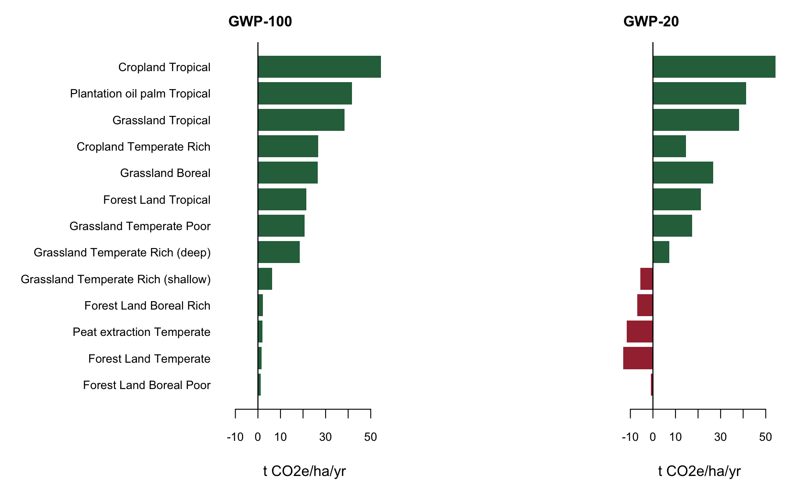
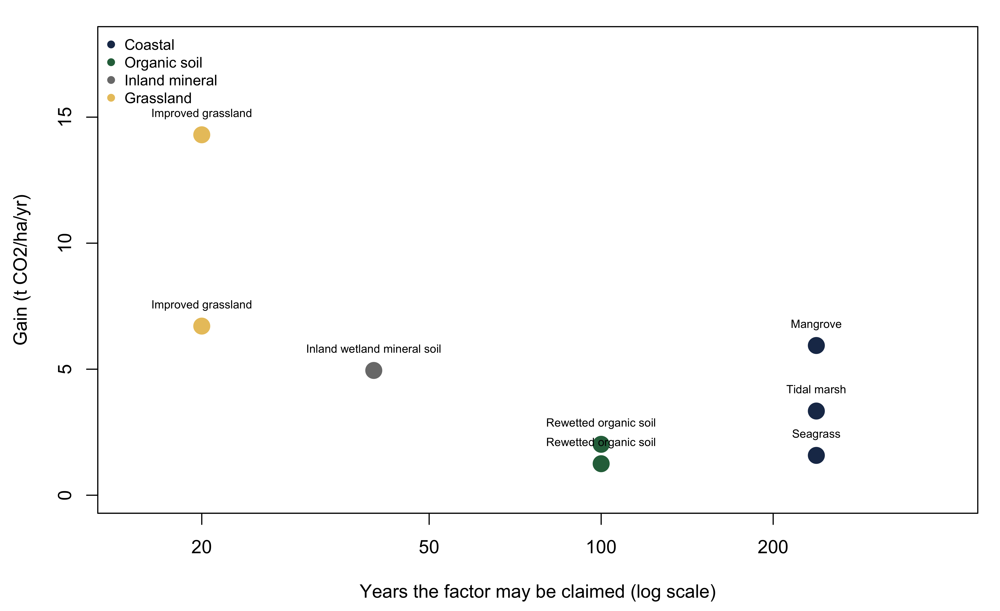
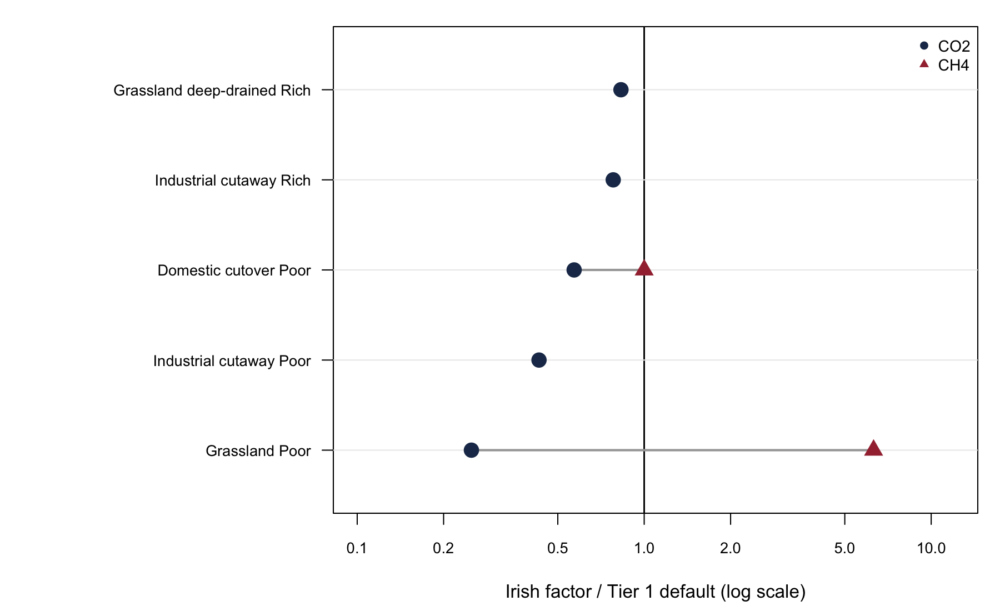

# ipcc-carbon-gains

**Net greenhouse gas balance of IPCC carbon gain pathways in peatlands, coastal wetlands and improved grasslands:
magnitude, duration and metric dependence, applied to Ireland**

Seamus Murphy ([0000-0002-1792-0351](https://orcid.org/0000-0002-1792-0351)) · Target venue **Carbon Balance and
Management**

Master: [`01.manuscript/ipcc-carbon-gains.qmd`](01.manuscript/ipcc-carbon-gains.qmd). Every figure below is computed
when the document is built. Nothing is typed in by hand.

    cd 01.manuscript && quarto render ipcc-carbon-gains.qmd --to html

------------------------------------------------------------------------------------------------------------------------

## Abstract

**Background.** The 2013 IPCC Wetlands Supplement replaced Equations 2.24 and 2.26 of the 2006 Guidelines, which had
implicitly assumed that organic soils can only lose carbon, introducing the first negative Tier 1 emission factors in
the guidelines' history. Soil carbon gains in peatlands, coastal wetlands and improved grasslands thereby became
countable, and creditable in principle. The pathways are scattered across two supplements and five chapters, their
duration rules differ by more than an order of magnitude, and no document in the corpus weights a pathway's carbon
dioxide gain against its methane and nitrous oxide costs. Whether a countable gain is a climate benefit therefore cannot
be determined from the guidance.

**Results.** We encode the default tables in base R, computing every figure at render time, and subtract the rewetted
flux from its drained counterfactual across thirteen land use, climate and nutrient combinations. At GWP-100 the benefit
is positive in every combination. At GWP-20 five turn negative, all temperate or boreal: three Forest Land cases,
nutrient-rich temperate Grassland, and temperate peat extraction. Monte Carlo sampling of the published 95% bounds puts
the probability of a benefit below 0.95 for five of thirteen combinations even at GWP-100. Beyond organic soils, a
restored tidal marsh below 18 ppt is a net source in absolute terms while remaining a large benefit against its drained
counterfactual; inland wetland mineral soil rewetting is a net source in all six climate zones for twenty years and has
no counterfactual in the guidance at all; and fertilised improved grassland crosses to a net source within decades,
because the soil gain is capped at twenty years while nitrous oxide is perpetual.

**Conclusions.** A countable carbon gain is not equivalent to a climate benefit. For a substantial minority of pathways
the sign of the benefit is set by the emission metric and horizon rather than by the emission factor. Inventory
compilers and crediting programmes should report the offsetting fluxes, the duration rule and the metric alongside any
claimed soil carbon gain.

------------------------------------------------------------------------------------------------------------------------

# Outputs

Every output in the order it appears in the manuscript: 22 tables, 3 figures, and one computed summary (T2, which prints
rather than tabulates). Figures are written to [`03.outputs/figures/`](03.outputs/figures/) at render time.

## Methods

| \# | Output | Result |
|----|----|----|
| **T1** | AR6 Table 7.15 emission metrics | Biogenic CH4 at **27.0** (GWP-100) and **79.7** (GWP-20); N2O at **273**. Not the molar-mass-adjusted figure |
| **T2** | Table 2.3 reference stocks | **42 cells** encoded across 8 climate zones and 6 soil classes; stated error ±5% to ±90% |
| **T3** | Rewetted organic soils, absolute flux | **A model input, not a result.** Every zone is a net source in absolute terms, because wet peat emits methane |

## Results

| \# | Output | Result |
|----|----|----|
| **T4** | Benefit of rewetting, 13 combinations | GWP-100 **+1.26 to +54.54**, no negative case. GWP-20 **−13.17 to +54.40**, five negative |
| **T5** | Monte Carlo, 10,000 triangular draws | P(benefit \> 0) below 0.95 for **5 of 13** rows at GWP-100, **the same five** that turn negative at GWP-20 |
| **F1** |  | Nothing changes between the panels except the weighting applied to methane |
| **T6** | Coastal wetland soil carbon | Mangrove **5.94**, tidal marsh **3.34**, seagrass **1.58** t CO2/ha/yr. Mangrove headroom 238 years |
| **T7** | Coastal, with and without the counterfactual | Below 18 ppt tidal marsh is **−1.89** absolute but **+27.08** against the drained state; mangrove **+0.71** and **+29.68** |
| **T8** | Inland wetland mineral soils | Net source in **6 of 6** climate zones in years 1–20, and 5 of 6 in years 21–40 |
| **T9** | Improved grassland gains | **0.92 to 6.71** t CO2/ha/yr from nominal; **1.97 to 14.30** from severely degraded |
| **T10** | Nitrogen break-even and crossover | **5.894 kg CO2e per kg N** at the IPCC default. Every fertilised grassland crosses eventually |
| **T11** | Ten most biased Table 2.3 cells | Mean exceeds median in **34 of 37** cells; median bias **13.0%**, maximum **154.5%** |
| **T12** | Area-weighted bias, 8 largest combinations | Weighting by mapped area moves the mean bias from **18.6% to 15.5%**; mountain sensitivity ±1 point |
| **T13** | The countable gain ledger | **8 pathways, 4 duration rules**, gains 1.25 to 14.30 t CO2/ha/yr |
| **F2** |  | Two pathways with the same annual factor are not the same asset |

## Results, global magnitude

Rates multiplied by mapped area, from the Harmonised World Soil Database. Every figure here is a bound, not an estimate,
and the manuscript says so in a callout.

| \# | Output | Result |
|----|----|----|
| **T14** | Organic soil rewetting by zone | **131 Mha** mapped (Boreal 104, Temperate 22, Tropical 5). If all of it were drained and then rewetted: **1,516 Mt CO2e/yr** at GWP-100, **877** at GWP-20. At an illustrative 10% drained, **152 Mt CO2e/yr** |
| **T15** | The two pathways with no derivable denominator | Wetland mineral soil **398 Mha at −13.02 t CO2e/ha/yr**, a net source; grassland proxy **1,830 Mha at 1.30 t CO2/ha/yr**. **No 100% total is given** for either: Chapter 5 applies only to *cultivated* wetland mineral soil, and the grassland denominator is ecological zone rather than managed pasture |

## Results, Ireland

| \# | Output | Result |
|----|----|----|
| **T16** | Irish factors against Tier 1 | Drained nutrient-poor grassland: CO2 **4.0× below** the default, CH4 **6.3× above** it |
| **F3** |  | CO2 below the line and CH4 above it, on the same hectares |
| **T17** | Irish rewetting benefit | **Both** pathways negative at GWP-100 and worse at GWP-20, on factors Ireland has adopted |
| **T18** | Three estimates of one intervention | **−0.48** (adopted factors), **+3.39** (measured at Glenvar), **+21** (Tuohy factor set) |
| **T19** | The nitrogen trap, measured factor | Crossover moves from **year 30 under CAN to year 73 under protected urea** |
| **T20** | National soils map SOC coverage | SOC populated on **67.7%** of mapped area; **92% of the peat is blank** |
| **T21** | Ireland's own inventory, added up | Benefit **+6.83 at AR5 GWP-100** (Ireland's own metric), **−2.89 at AR6 GWP-20** |
| **T22** | Saltmarsh by salinity class | **225 ha (9.9%)** exposed to the sub-18 ppt default; **90.1% unclassifiable** |
| **T23** | Methane under three metrics | GWP\* charges a sustained flux **0.28×** its GWP-100 value beyond year 20 |

**Ireland's near-natural peatland** is booked as a soil carbon removal of +0.33 t C/ha but is a **net source of +1.46 t
CO2e/ha/yr**, about **1.3 Mt** nationally, once Ireland's own reported dissolved organic carbon and methane are added.

**The EU adopted its carbon farming certification methodology on 9 July 2026.** It forbids default emission factors for
organic soils outright, requires methane to be quantified rather than assumed, prices the post-rewetting methane
transient at **10 t CO2e/ha/yr for five years**, and caps the crediting horizon at the physical exhaustion of the peat.
Not yet published in the Official Journal, verified against the Publications Office registry.

**Global pathway areas**, from the Harmonised World Soil Database, in
[`02.inputs/derived/global-pathway-areas.csv`](02.inputs/derived/global-pathway-areas.csv):

| Pathway                         | Dominant-component | Share-weighted         |
|---------------------------------|--------------------|------------------------|
| Organic soil (Histosols)        | **138 Mha**        | 116 Mha                |
| Wetland mineral soil (Gleysols) | **470 Mha**        | 322 Mha                |
| Other mineral soil              | 6,531 Mha          | 4,539 Mha              |
| **Total polygon area**          | **13,431 Mha**     | (global land ≈ 13,000) |

The Histosol figure is a **lower bound**: only dominant soil components survived the source merge, so peat occurring as
a subordinate component is invisible. Compare 265 Mha from the 5-arcminute raster and 400–500 Mha published.

------------------------------------------------------------------------------------------------------------------------

## Datasets and Scripts

Raw inputs never enter the render. A saved script writes a small CSV; the manuscript reads it with base `read.csv` and
does the IPCC arithmetic in visible chunks.

| Script                                       | Writes                                  |
|----------------------------------------------|-----------------------------------------|
| `05.scripts/prep-irish-soils.R`              | `derived/irish-soils-area-by-class.csv` |
| `05.scripts/prep-irish-crt.py`               | `derived/irish-crt-peat-balance.csv`    |
| `05.scripts/prep-irish-saltmarsh-salinity.R` | `derived/irish-saltmarsh-salinity.csv`  |
| `05.scripts/prep-global-area-weights.py`     | `derived/global-area-by-zone-soil.csv`  |
| `05.scripts/prep-global-pathway-areas.py`    | `derived/global-pathway-areas.csv`      |

Dataset provenance, dimensions and application, per folder: [`02.inputs/IPCC/README.md`](02.inputs/IPCC/README.md) ·
[`02.inputs/IRL/README.md`](02.inputs/IRL/README.md) · [`02.inputs/derived/README.md`](02.inputs/derived/README.md) ·
[`02.inputs/MANIFEST.md`](02.inputs/MANIFEST.md)

| Folder            | Contents                                                             |
|-------------------|----------------------------------------------------------------------|
| `01.manuscript/`  | Master `.qmd` and its HTML and DOCX renders                          |
| `02.inputs/`      | Raw data (gitignored), per-folder READMEs, committed `derived/` CSVs |
| `03.outputs/`     | Figures, written at render time                                      |
| `04.references/`  | `references.bib` (57 entries) and the CSL style                      |
| `05.scripts/`     | Pre-processing, one script per dataset                               |
| `tasks/`, `docs/` | Task requests, research design, quote-backed evidence base           |

